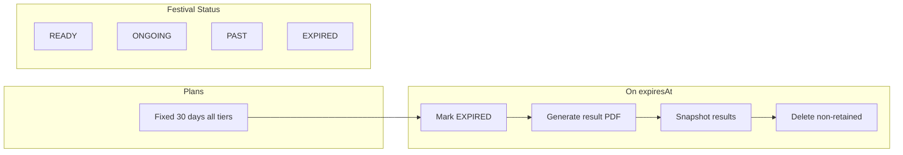

# Festival Validity System – Implementation Plan

## Current state (brief)

- **Schema:** [prisma/schema.prisma](prisma/schema.prisma): `FestivalStatus` = DRAFT | ACTIVE | EXPIRED; `Festival` has `startDate`, `endDate`, `expiresAt`; no result PDF storage; Result model exists and references ProgrammeAssignment/Programme/Student.
- **Pricing:** [src/config/pricing.ts](src/config/pricing.ts): `durationDays` differs per tier (30/90/180); `postExpiryAccess` and `dataRetentionDays` exist (read-only behaviour).
- **Cleanup:** [src/server/services/festival-lifecycle.service.ts](src/server/services/festival-lifecycle.service.ts): hard-deletes every festival where `expiresAt < now` (no retention, no tier logic).
- **Public site:** [src/app/(festivalPublic)/[slug]/layout.tsx](src/app/(festivalPublic)/[slug]/layout.tsx): when expired, returns `notFound()` (no “festival ended” page).
- **User festivals:** [src/components/profile/FestivalCard.tsx](src/components/profile/FestivalCard.tsx): shows EXPIRED and “scheduled for deletion”; no “View Details” or PDF download for expired.
- **Super Admin:** [src/components/admin/AdminFestivalCard.tsx](src/components/admin/AdminFestivalCard.tsx): status badge only; no expired-specific actions (retained info, PDF, lifecycle).
- **Analytics / Notifications:** No login-count, purchase-history, or notification tables; no cron/jobs for engagement emails.

---

## Architecture overview

- **Same duration:** All plans use one fixed duration (30 days). No post-expiry read-only; after 30 days the festival moves to **Expired State** only.
- **Expired state:** Run expiration process: keep festival row + retained data (metadata, results summary, result PDF); delete participants, media, sessions, etc.
- **Status:** READY (before start), ONGOING (start–end), PAST (after end, before expiry), EXPIRED (after expiry + process run).
- **UI:** Expired festivals: owner sees card with “Expired” badge and “View Details” (basic info + PDF only); public sees locked “festival ended” page (optional summary + PDF + notify). Super Admin sees expired badge and can view retained info + PDF + lifecycle.

---

## Phase 1: Config, status, and expiration contract

### 1.1 Unified duration and remove read-only

- In [src/config/pricing.ts](src/config/pricing.ts):
  - Set `durationDays: 30` for BASIC, STANDARD, and PRO.
  - Remove or repurpose `postExpiryAccess` / `dataRetentionDays` so there is no “read-only after expiry” (e.g. set to delete-only or single “expired” behaviour) so all code paths treat “expired” as full lock.
- In [src/server/services/festival-context.service.ts](src/server/services/festival-context.service.ts): remove or simplify `readOnlyExpired` so that when `isExpired` is true there is no writable or “read-only dashboard” access; redirect to profile (or expired view only).
- In [src/app/dashboard/[slug]/layout.tsx](src/app/dashboard/[slug]/layout.tsx): keep redirect when expired; ensure no branch allows dashboard access for expired festivals (only dedicated “expired view” route later).

### 1.2 Festival status entity (READY, ONGOING, PAST, EXPIRED)

- **Schema:** In [prisma/schema.prisma](prisma/schema.prisma), replace or extend `FestivalStatus` with: `READY` | `ONGOING` | `PAST` | `EXPIRED` (and migrate away from DRAFT/ACTIVE if desired; or map DRAFT→READY, ACTIVE→ONGOING for backward compatibility and add READY/ONGOING/PAST).
- **Derivation rule:** Status is derived from `startDate`, `endDate`, `expiresAt` and “expiration process run”:
  - **READY:** before `startDate` (or no startDate).
  - **ONGOING:** `startDate <= now <= endDate`.
  - **PAST:** `endDate < now < expiresAt` (festival ended but not yet expired).
  - **EXPIRED:** `now >= expiresAt` and expiration process has run (or mark EXPIRED when cron runs).
- Add a migration; ensure existing ACTIVE/DRAFT/EXPIRED map to the new enum (e.g. ACTIVE→ONGOING, EXPIRED→EXPIRED, DRAFT→READY).
- **Edit Festival modal:** In [src/components/profile/EditFestivalModal.tsx](src/components/profile/EditFestivalModal.tsx) (and any admin edit modal), add a **read-only** “Status” field showing the derived status (READY / ONGOING / PAST / EXPIRED). Optionally show `startDate`–`endDate` and `expiresAt` so organisers understand the lifecycle. Do not allow setting status manually; it is derived.
- **Cards/lists:** [FestivalCard](src/components/profile/FestivalCard.tsx), [AdminFestivalCard](src/components/admin/AdminFestivalCard.tsx), and any festival list: show the new status (and “Expired” badge when status is EXPIRED).

---

## Phase 2: Data retention and expiration process

### 2.1 What to retain (schema and snapshot)

- **Festival row:** Keep; optionally add columns:
  - `resultPdfUrl String?` (or `resultDocumentUrl`) to store the final result PDF/document URL after expiration.
  - `expiredAt DateTime?` to record when the expiration process ran (useful for lifecycle and analytics).
- **Results snapshot:** Current `Result` model has FKs to ProgrammeAssignment, Programme, Student. After expiry we delete students/assignments (and related), so we cannot keep Result rows as-is. Options:
  - **Option A (recommended):** New table `ExpiredFestivalResult` (or `FestivalResultSnapshot`): `festivalId`, `programmeName`, `categoryName`, `participantName` (or “Team X”), `position`, `grade`, `score`, `points`, `createdAt` (snapshot time). At expiry: copy published results into this table (denormalised), then delete Result, ProgrammeAssignment, Student, Programme, Category, Group, etc.
  - **Option B:** Keep Result and Programme/ProgrammeAssignment but remove Student and sensitive data (more complex and leaves FKs to “deleted” concepts).
- **Result PDF:** Before deleting data, generate one “final results” PDF per festival (using existing Result + Programme + Student data), upload to storage (e.g. Vercel Blob or S3), set `Festival.resultPdfUrl`, then run deletion.

### 2.2 What to delete on expiration

- **Delete (and cascade where applicable):**  
Students, ProgrammeAssignments, Categories, Groups, Programmes (after snapshot), Results (after snapshot), FestivalGalleryImage, FestivalNews, ScheduleEntry, Stage, Event (or retain event names in metadata if needed), FestivalMember, SupportTicket/SupportNotification for that festival.  
Keep: Festival (with basic fields + `resultPdfUrl` + `expiredAt`), Payment (already SetNull festivalId), ExpiredFestivalResult rows.
- **Media files:** Delete DB rows for gallery/news; actual file deletion depends on storage (Vercel Blob/S3): add a small step in expiration job to delete objects for that festival if you store URLs in DB.

### 2.3 Expiration service and cron

- **New (or refactor):** [src/server/services/festival-lifecycle.service.ts](src/server/services/festival-lifecycle.service.ts) (or `festival-expiration.service.ts`):
  1. Find festivals where `expiresAt < now` and `status != 'EXPIRED'` (or equivalent).
  2. For each: (a) Generate results PDF from current Result/Programme/Student data; (b) Upload PDF and set `Festival.resultPdfUrl` and `expiredAt`; (c) Insert into ExpiredFestivalResult from published results; (d) Delete in order: Result, ProgrammeAssignment, Student, Programme, Category, Group, FestivalGalleryImage, FestivalNews, ScheduleEntry, Stage, Event, FestivalMember, etc.; (e) Set `Festival.status = 'EXPIRED'` and clear or retain only needed metadata.
- **Cron:** Keep [src/app/api/cron/cleanup/route.ts](src/app/api/cron/cleanup/route.ts); call this new expiration process instead of “delete festival”. No tier branching: all plans 30 days, same retention rules.
- **Idempotency:** If a festival is already EXPIRED and has `resultPdfUrl`, skip or only update metadata so cron is safe to run repeatedly.

---

## Phase 3: User and public UI for expired festivals

### 3.1 “My Festivals” (user side)

- **Profile festival list:** In [FestivalCard](src/components/profile/FestivalCard.tsx): when status is EXPIRED, show a clear **Expired** badge; hide “Open Dashboard”; show a single primary action: **“View Details”** linking to a new route (e.g. `/profile/festivals/[festivalId]/expired` or `/profile/festivals/[slug]/expired`).
- **Expired “View Details” page (new):**
  - Route: e.g. `src/app/(overview)/profile/festivals/[slug]/expired/page.tsx` (or under profile with slug/id).
  - Content: Basic festival info (name, dates, description, etc.), and **Result PDF download** (link/button using `Festival.resultPdfUrl`). Do **not** list results in the UI; only the PDF.
  - Access control: only owner (or Super Admin) can view this page; 404 for others.
- **Dashboard:** Already redirect when expired in [layout](src/app/dashboard/[slug]/layout.tsx); ensure no link from profile leads to dashboard for expired festivals (only “View Details” to the new page).

### 3.2 Public festival website when expired

- **Stop returning 404:** In [src/app/(festivalPublic)/[slug]/layout.tsx](src/app/(festivalPublic)/[slug]/layout.tsx), when `isExpired` (and optionally `status === 'EXPIRED'`): instead of `notFound()`, render a **single “expired” layout** that shows:
  - Message: “This festival has ended.” / “Thank you for participating.” / “See you next year.”
  - Optional: short festival summary (name, dates), **Result PDF download** (if `resultPdfUrl` exists), and optional “Notify me about next edition” (email capture; requires a small table + API or existing notification signup if any).
- **Child routes:** For expired festivals, do not render normal public children (results, gallery, sessions, etc.). Either:
  - Use a single expired page at `/[slug]` when expired and block child routes (e.g. `/[slug]/results` redirects to `/[slug]`), or
  - Keep one layout that, when expired, always shows the same “ended” content for all `/[slug]/...` paths.
- **Registration/submissions/dashboard:** All registration and submission flows must check festival not expired and redirect or show “festival ended” if expired (no new submissions, no dashboard access).

---

## Phase 4: Super Admin – festival management and lifecycle

- **Festival list:** In [AdminFestivalCard](src/components/admin/AdminFestivalCard.tsx) and [FestivalsTable](src/components/super-admin/FestivalsTable.tsx): show **Expired** status badge for EXPIRED festivals; optionally separate tab or filter “Expired”.
- **Actions for expired festivals:** For festivals with status EXPIRED, allow:
  - **View retained info:** Link to a Super Admin page that shows festival basic metadata + list of ExpiredFestivalResult (read-only) and `resultPdfUrl` if present.
  - **Download result PDF:** Button/link using `Festival.resultPdfUrl`.
  - **Lifecycle history:** Add a simple **FestivalLifecycleEvent** (or use existing AuditLog) table: `festivalId`, `event` (e.g. `CREATED` | `ACTIVATED` | `EXPIRED`), `occurredAt`, `metadata Json?`. On expiration, insert an `EXPIRED` event. Super Admin UI: show timeline of events for the festival.

---

## Phase 5: Analytics foundation (Super Admin)

- **New tables (conceptual):**
  - **UserLoginEvent:** `userId`, `loggedAt` (or reuse existing session/token data if you log logins).
  - **PurchaseAnalytics** (or extend Payment): ensure every payment has `userId`, `festivalId`, `tier`, `amount`, `createdAt`; add indexes for reporting. Optionally a materialized or summary table: **UserPurchaseSummary** (userId, totalSpend, festivalIds[], planCountsByTier, lastPurchaseAt, etc.).
  - **FestivalCategoryPreference:** optional; derived from which festivals a user purchased (category from Festival).
- **Tracked metrics:** Total login count per user (from UserLoginEvent or auth logs), purchase history and timestamps, festivals purchased, monthly/yearly purchase patterns, 5-year trends, plans used, total spending, festival category preferences. Store in structured form (tables above) for reporting.
- **Super Admin UI:** New section “User behavior analytics” or “Analytics”: reports/dashboards (tables or charts) for login counts, purchase history, monthly/yearly frequency, spending, participation trends, category preferences. Can be implemented incrementally (first: purchase history and spending; then login counts; then trends).

---

## Phase 6: Notifications and engagement (foundation + optional AI)

- **Data needed:** User email, festival ownership and expiry dates, purchase history (from Phase 5). Optional: segment labels (e.g. “renewed”, “lapsed”, “first-time”).
- **Notification types:** Monthly engagement message, yearly festival reminder, plan renewal suggestion, personalized recommendations based on past participation. Implement as:
  - **NotificationTemplate** table (name, channel: email, body, variables) and **ScheduledNotification** or use a job queue (e.g. Inngest, Trigger.dev, or cron + DB table “pending_emails”).
  - Cron or queue worker: select users due for “monthly engagement” or “renewal reminder” and send email (e.g. Resend, SendGrid).
- **Optional AI:** Later: smart segmentation (e.g. by behaviour), personalized message generation, behaviour-based targeting, marketing content generation. This can be a separate phase after core notifications work; no schema change strictly required for a first version (use fixed templates and segments).

---

## Implementation order and file-level summary

| Phase   | Key files / changes                                                                                                                                                                                                                                                                                                      |
| ------- | ------------------------------------------------------------------------------------------------------------------------------------------------------------------------------------------------------------------------------------------------------------------------------------------------------------------------ |
| 1.1     | [src/config/pricing.ts](src/config/pricing.ts) (30 days, remove read-only semantics); [src/server/services/festival-context.service.ts](src/server/services/festival-context.service.ts) (remove readOnlyExpired); [src/app/dashboard/[slug]/layout.tsx](src/app/dashboard/[slug]/layout.tsx) (expired = redirect only). |
| 1.2     | [prisma/schema.prisma](prisma/schema.prisma) (FestivalStatus + migration); [EditFestivalModal](src/components/profile/EditFestivalModal.tsx) + admin modal (status display); [FestivalCard](src/components/profile/FestivalCard.tsx), [AdminFestivalCard](src/components/admin/AdminFestivalCard.tsx) (status/badge).    |
| 2.1     | [prisma/schema.prisma](prisma/schema.prisma) (resultPdfUrl, expiredAt, ExpiredFestivalResult table).                                                                                                                                                                                                                     |
| 2.2–2.3 | New expiration service (snapshot results, generate PDF, upload, delete non-retained, set EXPIRED); [src/app/api/cron/cleanup/route.ts](src/app/api/cron/cleanup/route.ts) calls it.                                                                                                                                      |
| 3.1     | [FestivalCard](src/components/profile/FestivalCard.tsx) (Expired → “View Details”); new profile route for expired festival view (basic info + PDF).                                                                                                                                                                      |
| 3.2     | [src/app/(festivalPublic)/[slug]/layout.tsx](src/app/(festivalPublic)/[slug]/layout.tsx) (expired → “ended” page); optional `/[slug]/expired` or same layout for all children when expired; ensure no registration/submission when expired.                                                                              |
| 4       | [AdminFestivalCard](src/components/admin/AdminFestivalCard.tsx) / FestivalsTable (Expired badge + actions); new SA page: view retained info + PDF + lifecycle; [prisma/schema.prisma](prisma/schema.prisma) (FestivalLifecycleEvent if new).                                                                             |
| 5       | New analytics tables; SA analytics section (reports/dashboards).                                                                                                                                                                                                                                                         |
| 6       | Notification templates + scheduling table or job queue; cron/worker; optional AI later.                                                                                                                                                                                                                                  |

---

## Risks and decisions

- **Result PDF generation:** Requires a PDF library (e.g. jsPDF, react-pdf, or server-side Puppeteer) and storage (Vercel Blob/S3). Decide storage and URL shape early so `resultPdfUrl` is stable.
- **Status derivation:** READY/ONGOING/PAST can be computed from dates in app code; EXPIRED should be set by the cron when the expiration process runs (so “EXPIRED” = processed, not just “past expiresAt”). Consider a flag `expirationProcessed Boolean @default(false)` if you want to distinguish “past expiry but not yet processed”.
- **Backward compatibility:** Existing ACTIVE/DRAFT/EXPIRED data must map to new enum in migration (data migration script).
- **Scope:** Phases 5 and 6 are large (analytics schema + reporting UI, notification infra + templates). Recommend implementing Phases 1–4 first for a “robust validity system”; then add 5–6 incrementally.

---

## Optional clarification

- **“Add status entity for festival modal”:** Interpreted as: add the **status** field (READY / ONGOING / PAST / EXPIRED) to the Festival model and display it in the Edit Festival modal (and cards). If you instead meant a separate “Status” entity (e.g. a table of status definitions), that can be a small addition (e.g. status display name and description).
- **Result PDF:** Spec says “results must be delivered only through a downloadable PDF/document” for expired view: plan assumes one stored PDF per festival at expiration time and optional on-demand regeneration for Super Admin if needed later.

