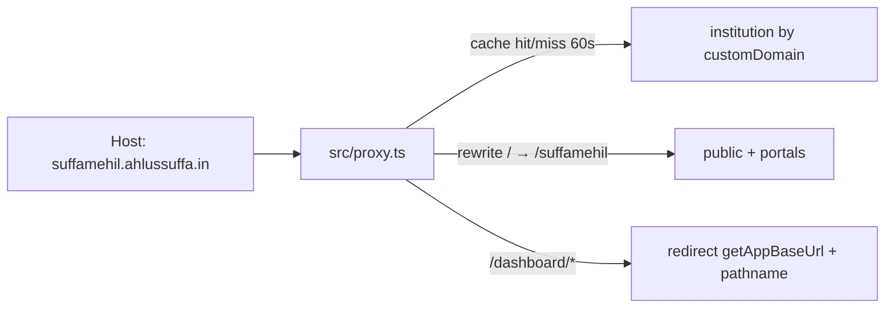

# Custom Domain (branded festival hosts)

**Status:** Shipped · certificates issued **per festival host** (see §1.1)  
**App host (prod):** `https://greenroomfestivals.in`  
**Tier gate:** `TIER_CONFIG.*.features.customDomain` — **PRO only** (`src/config/pricing.ts`)  
**Plan label:** Super Admin matrix → “Custom Domain” (`src/config/plan-features.config.ts`)  
**Surface:** Institutional festivals · Dashboard → Settings → **Launch Website** (`?tab=festival-live`)  

Related plan/grill notes: [`DOCS/custom_domain_wildcard_dns_2e9fc0b6.plan.md`](./custom_domain_wildcard_dns_2e9fc0b6.plan.md)
(historical — describes the wildcard-certificate design that §1.1 replaced)

---

## 1. What it is

Institutions on **PRO** can point one wildcard DNS record (`*`) at Greenroom so each festival is reachable at:

```text
https://{festivalSlug}.{customDomain}/
https://{festivalSlug}.{customDomain}/login
https://{festivalSlug}.{customDomain}/stage-portal
```

**Example**

| Piece | Value |
|-------|--------|
| Festival slug | `suffamehil` |
| Apex (saved by owner) | `ahlussuffa.in` |
| Branded public URL | `https://suffamehil.ahlussuffa.in` |
| Path URL (always available) | `https://greenroomfestivals.in/suffamehil` |
| Dashboard (always app host) | `https://greenroomfestivals.in/dashboard/suffamehil` |

Until the domain is **DNS-verified**, public URLs stay on the Greenroom path form.  
Until **HTTPS is proven on that festival's own host**, public URLs *also* stay on the path form — Greenroom only advertises `{slug}.{domain}` once a real TLS handshake against that exact host has succeeded (`festival.domainHttpsReadyAt`).

Dashboard always stays on the Greenroom app host. Requests to `/dashboard/*` on a custom host redirect to `getAppBaseUrl() + pathname`.

### 1.1 Why there is no wildcard certificate

**Read this before "simplifying" the design back to one wildcard domain.**

The original design attached a single `*.{apex}` domain to the Vercel project and
expected one wildcard certificate to cover every festival. That certificate can
never issue for a domain we do not host DNS for:

- A wildcard certificate can **only** be validated through the **DNS-01** ACME
  challenge. There is no HTTP-01 option for wildcards — the CA has no single host
  to fetch a token from.
- DNS-01 requires the issuing agent (Vercel) to write a TXT record into the zone
  at issuance **and again at every renewal**. That means handing Vercel the
  zone's nameservers.
- Institutions keep their own nameservers — the apex serves their existing
  website and their email MX records. Moving nameservers to Vercel breaks both,
  and §2 promises the institution's apex stays untouched.

Symptom when this was live: DNS verify passed, `*.{apex}` appeared on the Vercel
project with **"Verification Required"** and *"Move this domain to this team to
use Vercel nameservers"*, and the owner's screen sat on “Provisioning HTTPS…”
forever. Nothing was slow — the certificate was unobtainable.

**What replaced it.** Each festival host (`suffamehil.ahlussuffa.in`) is attached
to the Vercel project as its own domain. A single-label host validates over
**HTTP-01**: the CA fetches a token over plain HTTP from the host itself, which
already routes to Vercel through the owner's `*` CNAME. No zone control, no
nameserver change, no TXT record at renewal.

Consequences that shape the rest of this document:

- TLS readiness is **per festival** (`festival.domainHttpsReadyAt`), not per
  institution. One festival can be serving while its sibling has none.
- Something must attach and detach hosts across the festival lifecycle —
  publish, unpublish, delete, rename, apex change. See §9.
- The **owner's DNS does not change**. The `*` CNAME in their zone is still the
  right record and is what makes HTTP-01 reachable. Only the wildcard entry *on
  the Vercel project* is gone.

---

## 2. URL matrix

Example: slug `suffamehil` · apex `ahlussuffa.in` · app `greenroomfestivals.in`

| Surface | Not verified | Verified + HTTPS ready | Notes |
|---------|--------------|------------------------|--------|
| Dashboard | App host only | Still app host; custom-host `/dashboard/*` **redirects** to app | Never served on branded host |
| Public site | `…/suffamehil` | `suffamehil.ahlussuffa.in` | Path still works unless canonical redirect is enabled |
| Stage portal | `…/suffamehil/stage-portal` | `suffamehil.ahlussuffa.in/stage-portal` | |
| Participant login | `…/suffamehil/login` | `suffamehil.ahlussuffa.in/login` | |
| Live links UI | Path URLs | Prefer branded when verified | |
| Bare apex / `www` | n/a | **404** on our proxy | Institution’s own apex site stays untouched |

“Verified + HTTPS ready” is read per festival: verification is on the institution
(`verifiedAt`), readiness is on the festival (`domainHttpsReadyAt`). Both must
hold before a branded URL is advertised for that festival.

**Proxy rewrite** (custom Host + institution verified): path `P` → `/${festivalSlug}${P}`  
(e.g. `/login` → `/suffamehil/login`). Leave `/api/*` and `/_next/*` on the same origin (no rewrite). Unverified custom Host → 404.



---

## 3. Product rules (locked)

| Rule | Behavior |
|------|----------|
| Gate | Festival `tier` must enable `customDomain` (PRO). Non-PRO on a custom Host → 404. Path URLs still work for all tiers. |
| Who edits | Institution **owner** only (save / clear / verify). Managers see status + DNS instructions + branded URLs. |
| Soft checklist | Overview “Verify custom subdomain” → `settings?tab=festival-live`. Launch on `/{slug}` allowed without verify. |
| Verify | DNS only: TXT `_greenroom.{domain}` = `greenroom-verify={institutionId}` **and** wildcard CNAME `*` → `cname.vercel-dns.com`. Proves apex ownership once, for the whole institution. Verification alone attaches no host and issues no certificate — see §9. |
| Domain change | Saving/clearing clears `verifiedAt` immediately; cache invalidated. If the apex actually changed, every festival host under the old apex is detached and its `domainHttpsReadyAt` cleared. Old branded Host → 404 (≤60s cache). |
| Canonical redirect | Automatic in **production**: a public festival path on the app host 302s to the branded host as soon as that festival's `domainHttpsReadyAt` is stamped. No env switch to flip; `DISABLE_CUSTOM_DOMAIN_CANONICAL_REDIRECT=true` is the ops kill switch. Always off on localhost / non-production. |
| Branded-host links | On `{slug}.{apex}` every in-festival link drops the `/{slug}` prefix (`/news`, `/login`, `/{participantSlug}`). A leaked `/{slug}/…` path on the branded host 302s to the clean path. |
| Apex / www | Bare apex and `www.{domain}` → 404 (not festival hosts). |
| Post-expiry | Results + standings remain; news / media / participant login / stage portal blocked. |
| Slug uniqueness | Global (unchanged). No per-institution slug namespace. |
| Slug change | The host **is** the slug. Renaming detaches the old host, clears `domainHttpsReadyAt`, and attaches the new host if the festival was already public. The new host needs its own certificate, so branded URLs go quiet until it issues. |

---

## 4. End-to-end who does what

### Automated (default — Vercel API credentials present)

```text
1. Greenroom eng     → set VERCEL_TOKEN / VERCEL_PROJECT_ID / VERCEL_TEAM_ID
2. Institution owner → Save apex → publish DNS (TXT + *) → Verify DNS → Launch
3. System            → Attach {slug}.{apex} per festival, probe HTTPS,
                       show “HTTPS ready” for each festival on its own
4. Public users      → Use branded HTTPS URLs
```

No ops ticket, and nothing for the owner to do after Verify.

### Manual fallback (no Vercel API credentials)

```text
1. Greenroom eng     → deploy without VERCEL_* credentials
2. Institution owner → Save → DNS → Verify → Launch
3. Greenroom ops     → Add {slug}.{apex} on Vercel per published festival
4. Public users      → Use branded HTTPS URLs
```

This is the `manual-attach` phase in §9. It is the same code path — the probe
still notices the certificate and stamps readiness without a DB edit. Note that
ops adds **one host per festival** here, not `*.{apex}`; a wildcard entry will
never certify (§1.1).

---

## 5. Institution user workflow (owner)

**Prerequisites:** Institutional festival on **PRO**; logged in as institution **owner**.

| Step | Where | Action |
|------|--------|--------|
| 1 | `https://greenroomfestivals.in/dashboard/{slug}/settings` → **Launch Website** | Enter apex only (e.g. `ahlussuffa.in`) → **Save domain**. Not `www`, not a full URL. |
| 2 | Same screen → **DNS records** | At the domain DNS provider, add the two records shown in the UI (see below). |
| 3 | Same screen | Click **Verify DNS**. Status becomes **Verified** when both records resolve correctly. |
| 4 | Same screen | UI shows **Issuing a certificate for `{slug}.{apex}`** and polls every 15s, then flips to **HTTPS ready**. No ops ticket. If the deployment has no Vercel credentials the badge reads **DNS verified — awaiting HTTPS** instead and the alert asks Greenroom to attach that host — the manual path in §4. |
| 5 | Launch Website | **Go live** if not already. Path launch works **without** verify. Note a certificate only starts once the public site is on — an unpublished festival stays on “Issuing…” with its address reserved. |
| 6 | Share | After HTTPS ready: `https://{slug}.{domain}`, `/login`, `/stage-portal`. |

Each festival reaches **HTTPS ready** independently. Verifying the apex once does
not certify festivals that have not been published yet; those attach and certify
when they go live.

### DNS records (owner’s DNS panel)

| Type | Name / host | Value |
|------|-------------|--------|
| TXT | `_greenroom.{apex}` | `greenroom-verify={institutionId}` |
| CNAME | `*` | `cname.vercel-dns.com` |

Exact strings are copied from Festival Live after Save. These two records cover
every festival — the `*` CNAME routes each `{slug}.{apex}` and is also what lets
the CA reach each host for HTTP-01 validation, so **no per-festival DNS record is
ever needed**.

If Vercel ever returns a verification challenge of its own, Festival Live shows
it as an extra amber-bordered record block (“One more record is needed”) above
the Verify button. HTTP-01 should not produce one; the block exists so that if it
happens, the owner has something to act on rather than a stalled spinner.

**Managers:** can view status, DNS instructions, and branded URLs — cannot save/clear/verify.

---

## 6. Screens, UI steps & components

Click-path a user (or you) actually walks, with the React pieces behind each step.

### 6.1 Screen map

| # | Screen | Route | Primary components |
|---|--------|-------|-------------------|
| A | Festival **Overview** | `/dashboard/[slug]` | `OverviewWidgets` → `FestSetupWidget`, `LiveLinksCard`, `LaunchFestivalDrawer` |
| B | **Settings** shell | `/dashboard/[slug]/settings` | `settings/page.tsx` (RSC) → `SettingsTabs` |
| C | **Launch Website** tab | `…/settings?tab=festival-live` | `FestivalLiveClient` |
| D | Public festival (path) | `/{slug}` | `(festivalPublic)/[slug]/*` |
| E | Public festival (branded) | `https://{slug}.{domain}/` | Same app routes via `src/proxy.ts` rewrite |
| F | Participant login | `/{slug}/login` or branded `/login` | `src/app/[slug]/login/page.tsx` |
| G | Stage portal | `/{slug}/stage-portal` or branded `/stage-portal` | `src/app/[slug]/stage-portal/page.tsx` |

Dashboard organizer UI never stays on a branded host — proxy redirects `/dashboard/*` to the app host.

### 6.2 Step-by-step on screens (owner)

```text
Overview (A)
  ├─ Fest setup → “Verify custom subdomain”  ──href──►  Settings?tab=festival-live (C)
  └─ Fest setup → “Launch Festival”  ──opens──►  LaunchFestivalDrawer
        └─ CTA continues to Launch Website tab (C)

Settings → Launch Website (C)   ← main custom-domain UI
  ├─ Section “Public festival URL”     → copy / open (uses getPublicFestivalBaseUrl)
  ├─ Section “Custom subdomain”        → apex input, Save, Verify, DNS list, HTTPS alert
  └─ Section “Go live”                 → launch / take offline + preview iframe

Overview (A) again
  └─ “Live links” card                 → site / login / stage-portal (branded when verified)

Public / portals (D–G)
  └─ End users hit path or branded URLs after launch + (for branded) DNS+TLS
```

| Owner action | Screen | What they click / see | Component(s) |
|--------------|--------|----------------------|--------------|
| See soft checklist | Overview | Step **Verify custom subdomain** (incomplete until `verifiedAt`) | `FestSetupWidget` |
| Open domain UI from checklist | Overview → Settings | Click that step | `FestSetupWidget` → navigates to `?tab=festival-live` |
| Open domain UI from launch | Overview | **Launch Festival** → drawer → goes to Launch Website | `LaunchFestivalDrawer` |
| Open Settings directly | Sidebar / nav | Settings → tab **Launch Website** | `SettingsTabs` (`value: "festival-live"`, label “Launch Website”) |
| Save apex | Launch Website | **Custom subdomain** → input → **Save domain** | `FestivalLiveClient` → `PUT …/custom-domain` |
| Copy DNS instructions | Launch Website | TXT + CNAME block, any extra provider record, phase alert | `FestivalLiveClient` (`Alert` / `AlertTitle`) |
| Verify | Launch Website | **Verify DNS** | `FestivalLiveClient` → `POST …/custom-domain/verify` |
| Launch site | Launch Website | **Go live** control | `FestivalLiveClient` (launch / unpublish) |
| Share links | Overview | **Live links** copy/open | `LiveLinksCard` (URLs from `OverviewWidgets` + `getPublicFestivalBaseUrl`) |
| Preview same-origin | Launch Website | Preview iframe always `/{slug}` | `FestivalLiveClient` (`previewPath`) |

### 6.3 Component roles

| Component | File | Role |
|-----------|------|------|
| `OverviewWidgets` | `src/components/dashboard/overview/OverviewWidgets.tsx` | Loads the institution's `customDomain`/`verifiedAt` plus the festival's own `domainHttpsReadyAt`; builds `publicBaseUrl` via `getPublicFestivalBaseUrl`; passes verify flags into setup + live links |
| `FestSetupWidget` | `src/components/dashboard/overview/FestSetupWidget.tsx` | Soft step **Verify custom subdomain** (institutional PRO only); `href` → settings Launch Website tab |
| `LaunchFestivalDrawer` | `src/components/dashboard/overview/LaunchFestivalDrawer.tsx` | Overview launch entry; routes to `settings?tab=festival-live` |
| `LiveLinksCard` | `src/components/dashboard/overview/LiveLinksCard.tsx` | Copy/open public site, `/login`, `/stage-portal` using canonical `publicBaseUrl` |
| Settings page (RSC) | `src/app/dashboard/[slug]/settings/page.tsx` | Auth + loads festival/institution; computes `publicUrl`, `customDomain` props (`isOwner`, `isPro`, `isInstitutional`) |
| `SettingsTabs` | `src/app/dashboard/[slug]/settings/_components/SettingsTabs.tsx` | Tab chrome; mounts `FestivalLiveClient` when `tab=festival-live` |
| `FestivalLiveClient` | `…/settings/_components/FestivalLiveClient.tsx` | **All** domain save/verify UI, DNS copy, HTTPS warning, public URL, go-live, preview |
| `FeatureGate` / plan matrix | `src/components/common/FeatureGate.tsx`, `src/config/plan-features.config.ts` | Labels/gates “Custom Domain” for PRO |
| `src/proxy.ts` | (not a React screen) | Host rewrite, dashboard redirect, optional canonical redirect |

### 6.4 `FestivalLiveClient` UI blocks (in order)

1. **Header** — “Launch Website”  
2. **Public festival URL** — mono URL, Copy, Open (when live); adds login/stage URLs once **HTTPS is ready**  
3. **Custom subdomain** (only if `isInstitutional && isPro`)  
   - Phase badge: Not configured / Awaiting DNS verification / Provisioning HTTPS… / DNS verified — awaiting HTTPS / HTTPS ready / Needs attention  
   - Owner: apex `Input`, **Save domain**, **Verify DNS** (when saved & not verified)  
   - Non-owner: read-only note  
   - DNS records list, plus any extra record Vercel asks for, plus a phase-specific alert naming this festival's host (see §9)  
4. **Go live** — launch / take offline  
5. **Preview** — same-origin iframe of `previewPath` (`/{slug}`)

### 6.5 APIs the screens call

| UI action | Method | Route |
|-----------|--------|-------|
| Save / clear domain | `PUT` | `/api/v1/profile/institution/custom-domain` |
| Verify DNS | `POST` | `/api/v1/profile/institution/custom-domain/verify` |
| Poll TLS status | `GET` | `/api/v1/profile/institution/custom-domain/status?festivalId={id}` |
| Launch / unpublish | (existing festival live toggle inside `FestivalLiveClient`) | festival public-site APIs already used by Launch Website |

The status route takes a **`festivalId`** — readiness is per host, so it has to
know which festival is being asked about. It is readable by any institution
member (managers get view access); only save/clear/verify are owner-gated.
`FestivalLiveClient` polls it every 15s **only** while the phase is
`provisioning` or `manual-attach`, so a settled tab makes no background requests.

---

## 7. Greenroom developer / ops workflow

### 7.1 One-time project setup (prod)

1. Deploy Greenroom so it serves **`https://greenroomfestivals.in`**.
2. Vercel env (minimum related to this feature):
   - `NEXT_PUBLIC_APP_URL=https://greenroomfestivals.in`
   - `VERCEL_TOKEN`, `VERCEL_PROJECT_ID`, `VERCEL_TEAM_ID` — enables automated attach. All three or none; a partial set is treated as unset.
   - Leave `DISABLE_CUSTOM_DOMAIN_CANONICAL_REDIRECT` unset. Canonical redirect follows each festival's own `domainHttpsReadyAt`, so it cannot fire before that host serves TLS. Set it to `true` only to switch the behavior off in an incident.
3. Confirm PRO has `customDomain: true` in `src/config/pricing.ts`.
4. Apply schema migrations: `drizzle/0029_unusual_phantom_reporter.sql` (`institution.customDomain`, `verifiedAt`, unique index), `drizzle/0030_nifty_king_bedlam.sql` (`institution.httpsReadyAt` — now vestigial, see §8) and `drizzle/0050_festival_domain_https_ready.sql` (`festival.domainHttpsReadyAt`).
5. Confirm Settings → Launch Website shows **Custom subdomain** for PRO institutional festivals.

### 7.2 Per customer — automated (default)

Nothing to do. When the owner clicks **Verify DNS**:

1. Greenroom verifies the TXT + wildcard CNAME records and stamps
   `institution.verifiedAt`.
2. `attachPublishedFestivalsForInstitution` POSTs `{slug}.{apex}` for **every
   already-published** festival under that institution (409 “already attached” is
   treated as success). Unpublished festivals attach later, when they go live.
3. `syncFestivalDomainStatus` probes `https://{slug}.{apex}/`; the first
   successful handshake stamps `festival.domainHttpsReadyAt`.
4. Festival Live polls the status route and flips that festival to **HTTPS
   ready** on its own.

Ops involvement is token health and monitoring only.

**If you see a `*.{apex}` entry on the Vercel project**, it is a leftover from the
old design. It will sit on “Verification Required” forever and nothing references
it — remove it. Do not add new ones (§1.1).

### 7.3 Per customer — manual fallback (no Vercel credentials)

If `VERCEL_TOKEN` / `VERCEL_PROJECT_ID` / `VERCEL_TEAM_ID` are unset, the status
reports `manual-attach` and the owner sees “Awaiting HTTPS for `{slug}.{apex}`”.
Then:

1. Note their apex (e.g. `ahlussuffa.in`) and the festival slugs from Festival
   Live or the DB.
2. Vercel → Project → **Settings → Domains** → add **`{slug}.ahlussuffa.in`** for
   each published festival. One entry per festival — **not** `*.ahlussuffa.in`,
   which cannot be certified (§1.1).
3. Wait until each shows Valid / certificate issued.
4. Smoke in a browser:
   - `https://{slug}.ahlussuffa.in` → public site
   - `https://{slug}.ahlussuffa.in/login`
   - `https://{slug}.ahlussuffa.in/stage-portal`
   - `https://{slug}.ahlussuffa.in/dashboard/...` → redirects to `greenroomfestivals.in/dashboard/...`
5. No DB edit needed — the probe notices the working certificate and stamps
   `festival.domainHttpsReadyAt` on the next status poll.
6. Nothing to enable: once step 5 stamps `domainHttpsReadyAt`, app-host
   `/{slug}` and `/{slug}/…` start 302ing to the branded host on their own.

Redirecting before HTTPS is confirmed would send path URLs to a host that cannot
serve TLS and look “dead” while logs still show 2xx/3xx, which is exactly why
readiness — not an env flag — is the gate: `findBrandedRedirectTarget` answers
only for a festival whose own `domainHttpsReadyAt` is stamped.

---

## 8. Technical reference

### Data model

Ownership lives on the institution; TLS readiness lives on the festival.

`institution` table:

- `customDomain` — apex string, unique when set  
- `verifiedAt` — set after successful DNS verify; proves apex ownership once for the whole institution  
- `httpsReadyAt` — **vestigial.** Held wildcard-certificate readiness. Nothing reads it; `markInstitutionHttpsReady` / `clearInstitutionHttpsReady` are `@deprecated` and exist only so the column and helpers can be dropped in one later migration. Do not add readers.  

`festival` table:

- `domainHttpsReadyAt` — set once a TLS handshake against **this festival's own** `{slug}.{apex}` succeeds; cleared if it later stops serving, on unpublish/delete, on slug change, and when the institution's apex changes  

Migrations: `drizzle/0029_unusual_phantom_reporter.sql`,
`drizzle/0030_nifty_king_bedlam.sql` (the vestigial column),
`drizzle/0050_festival_domain_https_ready.sql`

`verifiedAt` and `domainHttpsReadyAt` are independent on purpose. A TLS failure
never clears DNS verification — only a domain change does. And because readiness
is per row, two festivals under the same verified apex legitimately disagree
about whether their branded URL is safe to advertise.

Both gates must hold before a branded URL is advertised, so a stale
`domainHttpsReadyAt` is never load-bearing on its own — re-saving the *same* apex
clears `verifiedAt` without touching readiness, and the branded URL correctly
disappears anyway.

### Key code

| Area | Path |
|------|------|
| Helpers + public URL builder + host builder + phase types | `src/features/institutions/lib/custom-domain.ts` |
| 60s in-process cache | `src/features/institutions/lib/custom-domain-cache.ts` |
| Institution repository + invalidate | `src/features/institutions/repositories/institution.repository.ts` |
| Festival readiness (`markFestivalHttpsReady` / `clearFestivalHttpsReady`) | `src/features/festivals/repositories/festival.repository.ts` |
| DNS verify | `src/features/institutions/services/custom-domain-verify.service.ts` |
| Vercel Domains API client (per host) | `src/features/institutions/services/vercel-domains.service.ts` |
| Attach + probe + status orchestration | `src/features/institutions/services/custom-domain-provisioning.service.ts` |
| Publish / unpublish hook | `src/features/festivals/actions/festival-crud.actions.ts` (`setPublicSiteEnabledAction`) |
| Delete + slug-change hooks | `src/app/api/v1/festivals/[id]/route.ts` (`DELETE`, `PUT`) |
| Host rewrite / redirect | `src/proxy.ts` |
| Save domain API | `PUT /api/v1/profile/institution/custom-domain` |
| Verify API | `POST /api/v1/profile/institution/custom-domain/verify` |
| Status API | `GET /api/v1/profile/institution/custom-domain/status?festivalId={id}` |
| Festival Live UI | `src/app/dashboard/[slug]/settings/_components/FestivalLiveClient.tsx` |
| Feature flag | `features.customDomain` in `src/config/pricing.ts` |

`src/proxy.ts` imports both repositories, so they must stay free of network side
effects. Vercel calls live in the services above and are invoked from route
handlers and server actions only — this is why `updateInstitutionCustomDomain`
returns `previousDomain` for the route to detach rather than detaching itself.

### Proxy behavior (important)

- Host routing runs for page navigations (matcher covers app routes).
- **CSRF / CSP security headers apply only to `/api/*`** — not to HTML documents. Applying strict CSP to all pages previously returned **200 with a blank/broken UI**.
- Canonical path→branded redirect is gated by production + non-localhost + the festival's own `domainHttpsReadyAt` in `findBrandedRedirectTarget`. `DISABLE_CUSTOM_DOMAIN_CANONICAL_REDIRECT=true` turns it off without a deploy.
- `/{slug}/editor` and `/{slug}/stage-portal` are excluded from that redirect (`APP_HOST_ONLY_FESTIVAL_SEGMENTS`): organizer and judge session cookies are scoped to the app host, so canonicalizing them would sign the person out.
- On a branded host, a request that still carries the `/{slug}` prefix 302s to the clean path (`stripFestivalSlugPrefix`). One segment is removed per hop, so a doubled prefix terminates instead of looping.
- The rewrite injects `x-custom-domain` alongside `x-institution-id` / `x-festival-slug`; `CustomDomainProvider` seeds it into the client tree so links render identically on the server and after hydration.

---

## 9. Provisioning internals

**Goal:** an institution owner gets working branded HTTPS after DNS verify
without asking Greenroom ops, on a domain whose nameservers they keep.

### Phase machine

`CustomDomainPhase` in `src/features/institutions/lib/custom-domain.ts`. All
phases are resolved **for one festival** by `syncFestivalDomainStatus`:

| Phase | Meaning | UI |
|-------|---------|-----|
| `no-domain` | No apex saved (or festival has no institution) | “Not configured” |
| `awaiting-dns` | Apex saved, `verifiedAt` null | “Awaiting DNS verification” + records |
| `provisioning` | Apex verified, this host's certificate not serving yet | “Issuing a certificate for `{slug}.{apex}`”, polls |
| `manual-attach` | Verified but no Vercel credentials — ops must attach this host | “Awaiting HTTPS for `{slug}.{apex}`”, polls |
| `https-ready` | TLS handshake against this host succeeded; `domainHttpsReadyAt` set | “HTTPS ready”, branded links appear |
| `error` | Festival missing / unrecoverable | “Needs attention” + detail |

`isCustomDomainPhasePending` marks the two phases worth polling.

`provisioning` covers two distinct situations, separated by `status.detail`:

- **Not published yet** — no host is attached, because a certificate cannot be
  issued for a host that serves nothing. Detail says to turn the public site on
  and that the address is reserved. This is a dead end until the owner acts, so
  the copy must not imply the system is working on it.
- **Published, certificate in flight** — the host is attached and HTTP-01 is
  running. This one really does resolve on its own, usually in minutes.

### Why an HTTPS probe, not the Vercel API

Vercel can report a domain as `verified` with `misconfigured: false` while the
certificate is still being issued, and manual-attach deployments have no API to
query at all. A successful TLS handshake against `https://{slug}.{apex}/` means
the same thing in both modes and is exactly what a visitor's browser does. Any
HTTP response — including our own 404 — proves the handshake; only
transport/TLS failures count as not-ready.

The probe targets the **real festival host**. It used to hit a sentinel label
(`_gr-tls-probe.{apex}`), which only worked because a wildcard certificate would
have covered any label. With per-host certificates a sentinel has no certificate
of its own and would report not-ready forever.

### Flow

```text
Save / change apex
  → verifiedAt cleared, cache invalidated, phase awaiting-dns
  → (apex actually changed or cleared?) detachAllFestivalsForApex(previousApex)
        → remove every {slug}.{previousApex} from the project
        → clear domainHttpsReadyAt on each festival that had it
Verify DNS
  → TXT + CNAME checked  → markInstitutionDomainVerified
  → attachPublishedFestivalsForInstitution
        → POST {slug}.{apex} for each published, PRO, institutional festival
          (409 = already attached)
Publish / unpublish / delete a festival
  → reconcileFestivalDomain(festivalId, shouldServe)
        → attach, or detach + clear readiness
Slug change
  → handleFestivalSlugChange(festivalId, previousSlug)
        → clear readiness, detach old host, re-attach new host if it was public
GET .../custom-domain/status?festivalId=…   (polled every 15s while pending)
  → syncFestivalDomainStatus
        → probe {slug}.{apex}
        → stamp or clear domainHttpsReadyAt
        → attach on demand if published but unattached
        → phase provisioning | manual-attach | https-ready
```

Lazy attach in the status route is what backfills festivals that were published
before their apex was verified, and re-attaches anything dropped on Vercel's
side. There is no backfill script and no scheduled job.

### Guarantees

- **Idempotent.** Re-verify and re-attach are safe; a 409 from Vercel is read back as the existing record.
- **Attach failure never rolls back DNS verification, and never fails the user's action.** A festival that fails to attach is still published, just on its path URL until the next poll retries. Failures surface as `status.detail`.
- **Self-healing both ways.** The probe sets `domainHttpsReadyAt` when the certificate starts serving and clears it if the certificate stops, so branded URLs stop being advertised rather than 404ing visitors.
- **Detach before delete.** `reconcileFestivalDomain(id, false)` runs while the row still exists — after the delete there is no slug to build a host from.
- **Nothing is orphaned on apex change.** Every host is released individually; with no wildcard there is no single entry to drop, and a host left behind blocks anyone else from claiming that apex.
- **No network in the proxy path.** Probing and Vercel calls happen in route handlers and server actions, never in `src/proxy.ts`'s import graph.
- **Bounded.** Vercel calls time out at 10s, the probe at 8s; `checkAttachStatus` never throws, so an outage degrades to “can't tell yet”.

### Out of scope (unchanged)

- Per-institution slug uniqueness (slugs stay globally unique)
- Institution-level tier column
- Enabling `customDomain` for STANDARD (gate remains PRO / `features.customDomain`)
- Dropping the vestigial `institution.httpsReadyAt` column (separate migration)

### Tests

| File | Covers |
|------|--------|
| `src/features/institutions/lib/custom-domain.test.ts` | URL builder gating on the festival's `domainHttpsReadyAt` (including two festivals under one verified apex disagreeing), `buildFestivalHost` normalization + rejection, phase-pending helper, host parsing, cache |
| `src/features/institutions/services/custom-domain-provisioning.service.test.ts` | Probe targets the real host, attach posts a bare host with no `*.` prefix, attach/detach failure handling, every `syncFestivalDomainStatus` phase, readiness set/clear, Vercel challenge records surfaced |
| `src/proxy.test.ts` | Branded-host rewrite + injected headers, leaked `/{slug}` prefix redirect, dashboard bounce, app-host canonical redirect (query preserved, editor/stage-portal excluded, kill switch, DB failure, localhost) |

---

## 10. Environment variables

| Variable | Purpose |
|----------|---------|
| `NEXT_PUBLIC_APP_URL` | App origin for redirects, emails, dashboard bounce from custom hosts. Prod: `https://greenroomfestivals.in` |
| `DISABLE_CUSTOM_DOMAIN_CANONICAL_REDIRECT` | Kill switch. Set `true` to stop app-host `/{slug}/…` → branded-host redirects; unset (default) lets each festival's `domainHttpsReadyAt` decide. |
| `VERCEL_URL` | Auto-included in app-host allowlist on Vercel deployments |
| `VERCEL_TOKEN` | Domains API token, scoped to the team. Required for automated attach. |
| `VERCEL_PROJECT_ID` | Target project (`prj_…`). Required for automated attach. |
| `VERCEL_TEAM_ID` | Team (`team_…`). Required for automated attach. |

All three Vercel vars must be present together. With any missing, the app stays
on the manual-attach path and reports `manual-attach` rather than erroring.

---

## 11. Local smoke (Windows)

Linux/macOS `curl`/`hosts` examples work too; below is Windows-first.

### 11.1 Hosts file

1. Open **Notepad as Administrator**.
2. Open: `C:\Windows\System32\drivers\etc\hosts`
3. Add (example):

```text
127.0.0.1 suffamehil.ahlussuffa.test
```

4. Save. Flush DNS if needed (Admin PowerShell):

```powershell
ipconfig /flushdns
```

### 11.2 Seed / DB

For a **PRO** institutional festival:

- Set `institution.customDomain` (e.g. `ahlussuffa.test`)
- Set `institution.verifiedAt` to now
- Set `festival.domainHttpsReadyAt` to now — the proxy does not need it, but
  `getPublicFestivalBaseUrl` and the branded redirect do, so leaving it null is
  the right way to test the “still on path URLs” half of the feature
- Optionally `festival.publicSiteEnabled = true`

Seed two festivals under the same institution and stamp
`domainHttpsReadyAt` on only one to exercise the per-festival gate — one should
advertise a branded URL while its sibling stays on the path form.

Do **not** expect the status route to reach `https-ready` locally: the probe
requires a real certificate on a public host, and `suffamehil.ahlussuffa.test`
has none. Locally the phase settles on `manual-attach` (no Vercel env) — which is
itself worth confirming, since it is the same code path a credential-less
production deployment takes.

### 11.3 Run app + probe (PowerShell)

```powershell
pnpm dev
```

```powershell
# Public rewrite on custom host (expect 200 when seeded)
Invoke-WebRequest -Uri http://127.0.0.1:3000/ `
  -Headers @{ Host = "suffamehil.ahlussuffa.test" } `
  -UseBasicParsing | Select-Object StatusCode

# Dashboard on custom host → redirect to app base
try {
  Invoke-WebRequest -Uri http://127.0.0.1:3000/dashboard/suffamehil `
    -Headers @{ Host = "suffamehil.ahlussuffa.test" } `
    -MaximumRedirection 0 -UseBasicParsing -ErrorAction Stop
} catch {
  [int]$_.Exception.Response.StatusCode
  $_.Exception.Response.Headers.Location
}
# Expect 307/302 and Location → http://localhost:3000/dashboard/suffamehil
```

Or browse: `http://suffamehil.ahlussuffa.test:3000/`

### 11.4 Confirm document CSP is not blanking the UI

```powershell
$r = Invoke-WebRequest http://127.0.0.1:3000/login -UseBasicParsing
"status=$($r.StatusCode) hasDocumentCsp=$([bool]$r.Headers['Content-Security-Policy'])"
# Pages should have NO Content-Security-Policy header.
# API routes still may set CSP — that is expected.
```

---

## 12. Confirm develop / prod checklist

### Greenroom side (`greenroomfestivals.in`)

- [ ] App loads on production app host  
- [ ] Migrations applied; PRO shows Custom subdomain in Launch Website  
- [ ] Owner can Save → sees TXT + CNAME instructions  
- [ ] After DNS: Verify succeeds  
- [ ] Publish a festival → **`{slug}.{apex}`** appears in Vercel → Domains as its **own** entry (not a wildcard) and goes **Valid** with no verification prompt  
- [ ] UI reaches “HTTPS ready” for that festival without ops  
- [ ] A second, unpublished festival under the same apex stays on its path URL  
- [ ] Branded HTTPS: public / login / stage-portal work  
- [ ] Dashboard on branded host redirects to app host  
- [ ] Canonical redirect env still **off** until HTTPS proven  
- [ ] No leftover `*.{apex}` entry on the Vercel project (§7.2)  

### Owner side

- [ ] PRO institutional festival  
- [ ] Apex saved (no `www`)  
- [ ] TXT + `*` CNAME published  
- [ ] Verify DNS green  
- [ ] After HTTPS: share branded links; Launch if needed  

---

## 13. Troubleshooting

| Symptom | Likely cause | Fix |
|---------|--------------|-----|
| HTML 200 but UI blank / nothing interactive | Document CSP applied via proxy to all routes | CSP must stay **API-only** (`src/proxy.ts`) |
| Verify fails on TXT | Wrong name/value or DNS not propagated | Match UI exactly; wait TTL; `nslookup -type=TXT _greenroom.apex` |
| Verify fails on CNAME | `*` not pointing at `cname.vercel-dns.com` | Fix wildcard CNAME. If the Vercel team issues a per-team target (`cname.vercel-dns-###.com`), `VERCEL_DNS_CNAME_TARGET` in `custom-domain.ts` must match it |
| Verified but browser TLS error on branded host | That festival's host is not attached on Vercel | Publish the festival (attach only happens for a public site), or attach `{slug}.{apex}` by hand on a credential-less deployment |
| Stuck on “Issuing a certificate” and the address is “reserved” | Festival's public site is off — no host attached, so nothing is being issued | Turn on **Go live**; the certificate starts then |
| Vercel shows `*.{apex}` as **Verification Required** | Leftover wildcard from the old design; wildcards need DNS-01 and can never certify here | Remove the entry (§1.1, §7.2). Do not move the customer's nameservers |
| One festival has HTTPS, another under the same apex does not | Expected — certificates are per host | Publish the second festival and wait for its own certificate |
| Branded URL disappeared after a rename | Slug change detaches the old host and clears readiness | Wait for the new host's certificate; the path URL works meanwhile |
| Path URL suddenly leaves Greenroom | Expected once that festival's branded HTTPS is ready | Nothing to fix; to stop it, set `DISABLE_CUSTOM_DOMAIN_CANONICAL_REDIRECT=true` |
| Branded host 404s on a link containing the slug | Stale `/{slug}/…` link or bookmark | The proxy 302s it to the clean path; update the link source if it is in-app |
| Custom Host → 404 | Unverified, wrong apex, or non-PRO on branded host | Verify DNS; confirm PRO; confirm slug belongs under that institution’s domain |
| Apex / www → 404 | By design | Festival hosts are `{slug}.{apex}` only |
| Changed domain; old host still works briefly | 60s cache | Wait or restart server instances; invalidate on save already |

---

## 14. Setup chain summary

| Actor | With Vercel credentials | Without |
|-------|-------------------------|---------|
| Greenroom developer | Maintain proxy / DNS verify / per-host attach | Same |
| Institution owner | Save → DNS → Verify → Launch | Same |
| Greenroom ops | Token health / monitoring only | **Manual** `{slug}.{apex}` per published festival |
| End users | Branded URLs once that festival's HTTPS is ready | Same |

---

## 15. Related files / docs

- Plan (historical, wildcard design): [`DOCS/custom_domain_wildcard_dns_2e9fc0b6.plan.md`](./custom_domain_wildcard_dns_2e9fc0b6.plan.md)
- Migration: `drizzle/0050_festival_domain_https_ready.sql`
- Proxy: `src/proxy.ts`
- Helpers: `src/features/institutions/lib/custom-domain.ts`
- Verify service: `src/features/institutions/services/custom-domain-verify.service.ts`
- Provisioning service: `src/features/institutions/services/custom-domain-provisioning.service.ts`
- UI (main): `FestivalLiveClient.tsx`, `SettingsTabs.tsx`, settings `page.tsx`
- Overview: `OverviewWidgets.tsx`, `FestSetupWidget.tsx`, `LiveLinksCard.tsx`, `LaunchFestivalDrawer.tsx`
