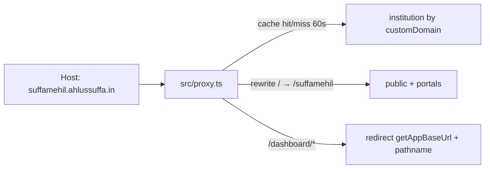

# Pro-tier Wildcard Custom Domains

## Decisions (locked)

- Gate on **`Festival.tier === PRO`** (no `Institution.tier`).
- Keep **global** `festival.slug` uniqueness.
- Stack: **Drizzle**, [`src/proxy.ts`](../src/proxy.ts), App Router at [`src/app`](../src/app).
- **URL policy:** unverified institution domain → public stays `/{slug}` on Greenroom; verified → branded `{slug}.{customDomain}`.
- **Canonical after verify (grilled):** Greenroom path URLs (`getAppBaseUrl()/{slug}/…`) **301/302 redirect** to `https://{slug}.{customDomain}/…` for public, stage-portal, and participant surfaces. Dashboard stays on Greenroom (no redirect-to-subdomain for `/dashboard`).
- **Dashboard on custom host:** `NextResponse.redirect(getAppBaseUrl() + pathname)` (preserve path/query).
- **Domain lookup cache:** 60s TTL; invalidate on domain save/verify/clear.
- **Post-expiry public:** results + standings remain on the same public URL; hide news, media, and participant login (change from today’s full `ExpiredFestivalView` lockout).
- **Post-expiry stage portal (grilled):** **Block** (404 / ended message) — same as participant login.
- **Verify Phase 1 (grilled):** DNS check only (CNAME/TXT) → set `verifiedAt`; UI warns that Greenroom must still attach the domain on Vercel for HTTPS until Step 4.5.
- **Who edits domain (grilled):** Only institution **owner** can save/verify `customDomain`. Festival Live shows status + DNS instructions + branded URLs to managers; edit controls owner-only.
- **Overview verify step (grilled):** Soft gate — Launch on `/{slug}` allowed without verify; checklist shows “Verify custom subdomain” incomplete until `verifiedAt`; CTA → `settings?tab=festival-live`. Not a hard block on `publicSiteEnabled`.
- **Tier vs subdomain (grilled):** Public festival on `/{slug}` remains available for **all tiers**. Custom subdomain hosts (`{slug}.{customDomain}`) are **PRO only** — non-PRO on a custom Host → 404; their path URL stays (no force-redirect to subdomain).
- **Apex / www (grilled):** Bare `{customDomain}` → 404 / “no festival here” (DNS `*` never matches the apex — needs its own record if pointed at us at all). `www.{customDomain}` **is** matched by `*` but is not a festival slug → same 404. Only `{festivalSlug}.{customDomain}` is a festival host. Pointing only `*.{domain}` at Vercel leaves the institution’s apex website **unaffected**.
- **Domain change (grilled):** **A** — on save/clear of `customDomain`, clear `verifiedAt` immediately and invalidate cache. Branded hosts only exist **after verify**; once verified then changed/cleared, old Host → 404 (≤60s cache), path URLs work again until the new domain is verified. UI warns before change.
- **Path → subdomain redirect (grilled):** Only when institution verified **and** festival PRO **and** `publicSiteEnabled`. Applies to public + `/login` + `/stage-portal` (one canonical host). If offline, no redirect — path behaves as today.
- **Festival Live iframe (grilled):** Preview iframe always same-origin `/{slug}`; Open/copy use canonical subdomain when verified.
- **DNS Verify checks (grilled):** **C** — require TXT `_greenroom.{customDomain}` = ownership token **and** wildcard CNAME `*` → Vercel target. Fail with which record is missing. Apex website untouched.

## Before / after (real URLs)

Example: slug `suffamehil` · apex `ahlussuffa.in`

| Surface | Before | After (verified) | After (not verified) |
| --- | --- | --- | --- |
| Dashboard | `greenroomm.vercel.app/dashboard/suffamehil` | Still Greenroom; custom-host `/dashboard/*` **redirects** to app base | same |
| Public site | `…/suffamehil` | `suffamehil.ahlussuffa.in` | `…/suffamehil` |
| Stage portal | `…/suffamehil/stage-portal` | `suffamehil.ahlussuffa.in/stage-portal` | path on Greenroom |
| Participant login | `…/suffamehil/login` | `suffamehil.ahlussuffa.in/login` | path on Greenroom |
| Live links UI | path URLs | subdomain URLs | path URLs |
| Old path after verify | n/a | **Redirect** path → subdomain (canonical) | path stays |

Proxy rewrite when Host is custom + institution **verified**: path `P` → `/${festivalSlug}${P}` (e.g. `/login` → `/suffamehil/login`). Leave `/api/*` as-is on same origin. Unverified custom Host → 404 (do not rewrite).



---

## Step 1: Schema (Drizzle)

**File:** [`src/core/database/schema.ts`](../src/core/database/schema.ts)

```ts
customDomain: text(),       // apex e.g. "ahlussuffa.in"
verifiedAt: tzTimestamp(),  // null until DNS verified
```

- `uniqueIndex("institution_customDomain_key")` on `customDomain`.
- No `Institution.tier`. Festival already has `institutionId`.

```bash
pnpm db:generate
pnpm db:push
```

---

## Step 2: Proxy host routing + 60s cache

**File:** [`src/proxy.ts`](../src/proxy.ts)

### Host parse

```ts
function parseCustomFestivalHost(hostHeader: string, appHosts: Set<string>) {
  const hostname = hostHeader.split(":")[0].toLowerCase();
  if (appHosts.has(hostname)) return null;
  const labels = hostname.split(".");
  if (labels.length < 2) return null;
  return {
    festivalSlug: labels[0],
    customDomain: labels.slice(1).join("."),
  };
}
```

### Behavior

1. **App hosts** (`greenroomm.vercel.app`, localhost): no festival rewrite; keep CSRF for `/api`.
2. **Custom host:**
   - `/api/*`, `/_next/*`, static → no rewrite (same origin for cookies).
   - **`/dashboard/*` (and other organizer-only paths if needed):**  
     `return NextResponse.redirect(new URL(pathname + search, getAppBaseUrl()))`  
     i.e. `NextResponse.redirect(getAppBaseUrl() + pathname)` (+ search). Cleaner than rewrite/404.
   - Other paths (`/`, `/results`, `/standings`, `/stage-portal`, `/login`, `/{participantSlug}/…`):
     - Resolve institution via **cached** `findVerifiedInstitutionByCustomDomain(apex)`
     - Missing / unverified → 404
     - Else inject `x-institution-id`, `x-festival-slug`, optional `x-custom-domain`
     - Rewrite to `/${festivalSlug}${pathname === "/" ? "" : pathname}${search}`
3. Widen `config.matcher` to page routes (exclude static assets).

### Domain → institution cache (required)

Every visit to `xyz.college.ac.in` needs “who owns `college.ac.in`?” (~10–50ms DB). Under load that hammers Postgres.

**Solution:**

- Cache key: normalized `customDomain` (apex).
- Value: `{ institutionId } | null` (null = negative cache for unknown/unverified).
- TTL: **60 seconds**.
- Implementation: module-level `Map` with `{ expiresAt, value }` in the Node proxy process, **or** `unstable_cache` / small Redis if already available — prefer in-process Map for Phase 1 (simple, zero infra).
- **Invalidate immediately** when:
  - customDomain saved / changed / cleared
  - verify succeeds or fails in a way that clears `verifiedAt`
- After invalidate, next request refetches; subsequent requests within 60s skip DB.

**Helpers:**

- [`src/features/institutions/lib/custom-domain.ts`](../src/features/institutions/lib/custom-domain.ts) — parse, normalize, app-host set, `getPublicFestivalBaseUrl({ slug, institution })` (subdomain if verified else `getAppBaseUrl()/{slug}`).
- [`src/features/institutions/repositories/institution.repository.ts`](../src/features/institutions/repositories/institution.repository.ts) — `findVerifiedInstitutionByCustomDomain` + `invalidateCustomDomainCache(domain)`.

**Cookies:** `participant_session` / `stage_portal_session` remain host-only — correct for branded host.

---

## Step 3: Public + portal routes; post-expiry rules

### Surfaces (same rewrite)

| Custom-host URL | Internal |
| --- | --- |
| `/` | [`(festivalPublic)/[slug]`](../src/app/(festivalPublic)/[slug]/page.tsx) |
| `/stage-portal` | [`[slug]/stage-portal`](../src/app/[slug]/stage-portal/page.tsx) |
| `/login` | [`[slug]/login`](../src/app/[slug]/login/page.tsx) |
| `/{participantSlug}/…` | [`(participant)/…`](../src/app/(participant)/[slug]/[participantSlug]/page.tsx) |

### Lookup

`findFestivalBySlugForPublic(slug, institutionId?)` — when `x-institution-id` set, require matching `institutionId` + `tier === "PRO"`; else slug-only as today.

### Post-expiry public behavior (product change)

Today: expired → only [`ExpiredFestivalView`](../src/components/festival/public/ExpiredFestivalView.tsx) (PDF).

**New rule** (path URL and custom subdomain alike):

| After expiry | Behavior |
| --- | --- |
| Results / standings | **Still available** on the same public URL (do not wipe public data) |
| News | **Hidden** (404 or omit from nav) |
| Media | **Hidden** |
| Participant login + participant app | **Hidden / blocked** |
| Stage portal | **Blocked** (404 / ended) |
| Participant login + participant app | **Hidden / blocked** |
| Landing | Slim “ended” chrome with standings/results entry points only |

Implement in [`(festivalPublic)/[slug]/layout.tsx`](../src/app/(festivalPublic)/[slug]/layout.tsx) and child routes / nav: stop short-circuiting the entire tree to `ExpiredFestivalView`; instead gate sections. Update [`ExpiredFestivalView`](../src/components/festival/public/ExpiredFestivalView.tsx) or replace with an “ended” banner + results/standings.

Also gate [`[slug]/login`](../src/app/[slug]/login/page.tsx) and participant guards when festival expired.

---

## Step 4: Festival Live tab + verify API

**Primary UX home for subdomain:** Launch Website / Festival Live settings tab — **not** only profile institution settings.

### Current problem

[`FestivalLiveClient`](../src/app/dashboard/[slug]/settings/_components/FestivalLiveClient.tsx) is `fixed inset-0 z-50` fullscreen, so tab chrome and details disappear.

### Target UX

1. **Inline tab content** (visible settings layout + tab):
   - Festival public URL preview (path vs subdomain)
   - **Institution subdomain config:** enter apex (`ahlussuffa.in`), DNS instructions, Verify button, verified/unverified status
   - Expected branded URLs: `{slug}.{domain}`, `…/stage-portal`, `…/login`
   - Launch / Take Offline controls
2. **Launch** still opens the same fullscreen live experience (iframe + Live pill) as today — optional overlay **on top of** launch, not the only view of the tab.
3. **Live / Open / copy links:**
   - If institution `customDomain` + `verifiedAt` → `https://{slug}.{customDomain}`
   - Else → `getAppBaseUrl()/{slug}` (and same for stage-portal / login)

### API

- Extend institution update (or festival-live-scoped endpoint) to set `customDomain` (clears `verifiedAt` on change).
- [`…/custom-domain/verify`](../src/app/api/v1/profile/institution/custom-domain/verify/route.ts): PRO check, DNS TXT/CNAME check, set `verifiedAt`, **invalidate cache**.

### Live links elsewhere

[`LiveLinksCard`](../src/components/dashboard/overview/LiveLinksCard.tsx) + settings `publicUrl` builder in [`settings/page.tsx`](../src/app/dashboard/[slug]/settings/page.tsx): use shared `getPublicFestivalBaseUrl`.

---

## Step 4.5: Vercel domain + TLS provisioning (Phase 2 — flag now)

**Canonical feature doc:** [`DOCS/features/CUSTOM_DOMAIN.md`](./features/CUSTOM_DOMAIN.md) (Phase 1 shipped + Phase 2 scope).

**TODO (defer implementation, document in Phase 1):**

> Integrate **Vercel Domains API** to add `{customDomain}` + wildcard `*.{customDomain}` to the Greenroom project and wait for TLS, **or** document the **manual** Vercel Dashboard steps (Add Domain → wildcard → DNS targets) that ops/institution must complete before Verify can succeed.

Phase 1 Verify may succeed on DNS alone while TLS still depends on the domain existing on the Vercel project — call this out in UI copy (“Ask Greenroom to attach your domain” / link to docs) until Phase 2 automates it.

---

## Step 4.6: Dashboard overview checklist step

**File:** [`FestSetupWidget.tsx`](../src/components/dashboard/overview/FestSetupWidget.tsx)

Add step e.g. **“Verify custom subdomain”** (institutional + PRO only):

- Incomplete when institution has no `verifiedAt` (or no `customDomain`).
- CTA → `/dashboard/{slug}/settings?tab=festival-live`
- Also fix Launch Festival path to deep-link `?tab=festival-live` (today [`LaunchFestivalDrawer`](../src/components/dashboard/overview/LaunchFestivalDrawer.tsx) goes to settings without tab).

---

## Step 5: Local testing

### hosts file

```text
127.0.0.1 ahlussuffa.test
127.0.0.1 suffamehil.ahlussuffa.test
```

### Seed

```sql
UPDATE institution
SET "customDomain" = 'ahlussuffa.test', "verifiedAt" = NOW()
WHERE id = '<id>';
-- festival.slug = 'suffamehil', institutionId set, tier = 'PRO', publicSiteEnabled = true
```

### Checks

```bash
pnpm dev
# verified custom host
curl -sI -H "Host: suffamehil.ahlussuffa.test" http://127.0.0.1:3000/
curl -sI -H "Host: suffamehil.ahlussuffa.test" http://127.0.0.1:3000/stage-portal
curl -sI -H "Host: suffamehil.ahlussuffa.test" http://127.0.0.1:3000/login
# dashboard redirect to app base
curl -sI -H "Host: suffamehil.ahlussuffa.test" http://127.0.0.1:3000/dashboard/suffamehil
# unverified → 404 on custom host; path URL still works
# expiry: / and /results|/standings OK; /news /media /login blocked
# cache: two rapid requests for same apex → one DB hit (log/metric)
```

### Unit tests

- Host parser for `suffamehil.ahlussuffa.in`
- `getPublicFestivalBaseUrl` verified vs unverified
- Cache TTL + invalidate after verify

---

## Implementation order

1. Schema + migration  
2. Domain helpers + **60s cache** + invalidation hooks  
3. Proxy rewrite + **dashboard redirect** via `getAppBaseUrl() + pathname`  
4. Public/portal institution+PRO gate  
5. **Post-expiry** results/standings keep; hide news/media/participant login  
6. **Festival Live tab** refactor (inline subdomain + launch; fullscreen preview only)  
7. Verify API + live URL helper (subdomain iff verified)  
8. Overview checklist step → `settings?tab=festival-live`  
9. Document **Step 4.5** Phase 2 Vercel Domains/TLS TODO in UI/docs  
10. Manual / Host-header tests  

## Out of scope / Phase 2

- Vercel Domains API auto-provision + TLS wait (Step 4.5)
- Per-institution slug uniqueness
- Institution-level tier column
- STANDARD-tier custom domains (gate remains PRO)
