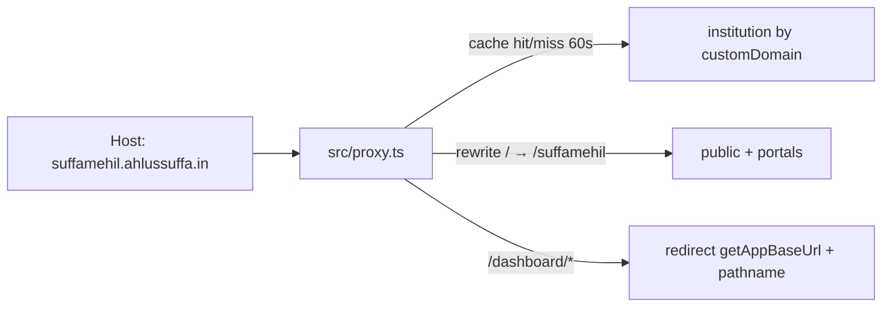

# Custom Domain (wildcard branded hosts)

**Status:** Phase 1 shipped · Phase 2 planned  
**App host (prod):** `https://greenroomm.vercel.app`  
**Tier gate:** `TIER_CONFIG.*.features.customDomain` — **PRO only** (`src/config/pricing.ts`)  
**Plan label:** Super Admin matrix → “Custom Domain” (`src/config/plan-features.config.ts`)  
**Surface:** Institutional festivals · Dashboard → Settings → **Launch Website** (`?tab=festival-live`)  

Related plan/grill notes: [`DOCS/custom_domain_wildcard_dns_2e9fc0b6.plan.md`](../custom_domain_wildcard_dns_2e9fc0b6.plan.md)

---

## 1. What it is

Institutions on **PRO** can point a wildcard DNS name at Greenroom so each festival is reachable at:

```text
https://{festivalSlug}.{customDomain}/
https://{festivalSlug}.{customDomain}/login
https://{festivalSlug}.{customDomain}/stage-portal
```

**Example**

| Piece | Value |
|-------|--------|
| Festival slug | `suffamehil` |
| Apex (saved by owner) | `ahlussuffa.in` |
| Branded public URL | `https://suffamehil.ahlussuffa.in` |
| Path URL (always available) | `https://greenroomm.vercel.app/suffamehil` |
| Dashboard (always app host) | `https://greenroomm.vercel.app/dashboard/suffamehil` |

Until the domain is **DNS-verified**, public URLs stay on the Greenroom path form.  
Until **TLS is attached** on Vercel (Phase 1 = manual; Phase 2 = automated), browsers cannot reliably use HTTPS on the branded host.

Dashboard always stays on the Greenroom app host. Requests to `/dashboard/*` on a custom host redirect to `getAppBaseUrl() + pathname`.

---

## 2. URL matrix

Example: slug `suffamehil` · apex `ahlussuffa.in` · app `greenroomm.vercel.app`

| Surface | Not verified | Verified + HTTPS ready | Notes |
|---------|--------------|------------------------|--------|
| Dashboard | App host only | Still app host; custom-host `/dashboard/*` **redirects** to app | Never served on branded host |
| Public site | `…/suffamehil` | `suffamehil.ahlussuffa.in` | Path still works unless canonical redirect is enabled |
| Stage portal | `…/suffamehil/stage-portal` | `suffamehil.ahlussuffa.in/stage-portal` | |
| Participant login | `…/suffamehil/login` | `suffamehil.ahlussuffa.in/login` | |
| Live links UI | Path URLs | Prefer branded when verified | |
| Bare apex / `www` | n/a | **404** on our proxy | Institution’s own apex site stays untouched |

**Proxy rewrite** (custom Host + institution verified): path `P` → `/${festivalSlug}${P}`  
(e.g. `/login` → `/suffamehil/login`). Leave `/api/*` and `/_next/*` on the same origin (no rewrite). Unverified custom Host → 404.



---

## 3. Product rules (locked)

| Rule | Behavior |
|------|----------|
| Gate | Festival `tier` must enable `customDomain` (PRO). Non-PRO on a custom Host → 404. Path URLs still work for all tiers. |
| Who edits | Institution **owner** only (save / clear / verify). Managers see status + DNS instructions + branded URLs. |
| Soft checklist | Overview “Verify custom subdomain” → `settings?tab=festival-live`. Launch on `/{slug}` allowed without verify. |
| Verify (Phase 1) | DNS only: TXT `_greenroom.{domain}` = `greenroom-verify={institutionId}` **and** wildcard CNAME `*` → `cname.vercel-dns.com`. |
| Domain change | Saving/clearing clears `verifiedAt` immediately; cache invalidated. Old branded Host → 404 (≤60s cache). |
| Canonical redirect | Opt-in: `ENABLE_CUSTOM_DOMAIN_CANONICAL_REDIRECT=true` in **production only**, and only after wildcard HTTPS works. Off by default; always off on localhost / non-production. |
| Apex / www | Bare apex and `www.{domain}` → 404 (not festival hosts). |
| Post-expiry | Results + standings remain; news / media / participant login / stage portal blocked. |
| Slug uniqueness | Global (unchanged). No per-institution slug namespace. |

---

## 4. End-to-end who does what

### Phase 1 (today)

```text
1. Greenroom eng     → ship/deploy Phase 1 code + migration + PRO gate
2. Institution owner → Save apex → publish DNS (TXT + *) → Verify DNS → Launch
3. Greenroom ops     → Manually add *.{domain} on Vercel → wait for TLS
4. Public users      → Use branded HTTPS URLs
```

### Phase 2 (planned)

```text
1. Greenroom eng     → Vercel Domains API + TLS status in UI
2. Institution owner → Save → DNS → Verify (same) — no “ask Greenroom” step
3. System            → Auto-attach *.{domain}, poll TLS, show “HTTPS ready”
4. Public users      → Use branded HTTPS URLs
```

---

## 5. Institution user workflow (owner)

**Prerequisites:** Institutional festival on **PRO**; logged in as institution **owner**.

| Step | Where | Action |
|------|--------|--------|
| 1 | `https://greenroomm.vercel.app/dashboard/{slug}/settings` → **Launch Website** | Enter apex only (e.g. `ahlussuffa.in`) → **Save domain**. Not `www`, not a full URL. |
| 2 | Same screen → **DNS records** | At the domain DNS provider, add the two records shown in the UI (see below). |
| 3 | Same screen | Click **Verify DNS**. Status becomes **Verified** when both records resolve correctly. |
| 4a | **Phase 1** | Contact Greenroom / wait — ops must attach `*.{domain}` on Vercel and wait for certificate. UI alerts: DNS verify alone is not enough for browsers. |
| 4b | **Phase 2** | UI shows “Provisioning TLS…” then “HTTPS ready” — no ops ticket. |
| 5 | Launch Website | **Go live** if not already. Path launch works **without** verify. |
| 6 | Share | After HTTPS ready: `https://{slug}.{domain}`, `/login`, `/stage-portal`. |

### DNS records (owner’s DNS panel)

| Type | Name / host | Value |
|------|-------------|--------|
| TXT | `_greenroom.{apex}` | `greenroom-verify={institutionId}` |
| CNAME | `*` | `cname.vercel-dns.com` |

Exact strings are copied from Festival Live after Save.

**Managers:** can view status, DNS instructions, and branded URLs — cannot save/clear/verify.

---

## 6. Screens, UI steps & components

Click-path a user (or you) actually walks, with the React pieces behind each step.

### 6.1 Screen map

| # | Screen | Route | Primary components |
|---|--------|-------|-------------------|
| A | Festival **Overview** | `/dashboard/[slug]` | `OverviewWidgets` → `FestSetupWidget`, `LiveLinksCard`, `LaunchFestivalDrawer` |
| B | **Settings** shell | `/dashboard/[slug]/settings` | `settings/page.tsx` (RSC) → `SettingsTabs` |
| C | **Launch Website** tab | `…/settings?tab=festival-live` | `FestivalLiveClient` |
| D | Public festival (path) | `/{slug}` | `(festivalPublic)/[slug]/*` |
| E | Public festival (branded) | `https://{slug}.{domain}/` | Same app routes via `src/proxy.ts` rewrite |
| F | Participant login | `/{slug}/login` or branded `/login` | `src/app/[slug]/login/page.tsx` |
| G | Stage portal | `/{slug}/stage-portal` or branded `/stage-portal` | `src/app/[slug]/stage-portal/page.tsx` |

Dashboard organizer UI never stays on a branded host — proxy redirects `/dashboard/*` to the app host.

### 6.2 Step-by-step on screens (owner)

```text
Overview (A)
  ├─ Fest setup → “Verify custom subdomain”  ──href──►  Settings?tab=festival-live (C)
  └─ Fest setup → “Launch Festival”  ──opens──►  LaunchFestivalDrawer
        └─ CTA continues to Launch Website tab (C)

Settings → Launch Website (C)   ← main custom-domain UI
  ├─ Section “Public festival URL”     → copy / open (uses getPublicFestivalBaseUrl)
  ├─ Section “Custom subdomain”        → apex input, Save, Verify, DNS list, HTTPS alert
  └─ Section “Go live”                 → launch / take offline + preview iframe

Overview (A) again
  └─ “Live links” card                 → site / login / stage-portal (branded when verified)

Public / portals (D–G)
  └─ End users hit path or branded URLs after launch + (for branded) DNS+TLS
```

| Owner action | Screen | What they click / see | Component(s) |
|--------------|--------|----------------------|--------------|
| See soft checklist | Overview | Step **Verify custom subdomain** (incomplete until `verifiedAt`) | `FestSetupWidget` |
| Open domain UI from checklist | Overview → Settings | Click that step | `FestSetupWidget` → navigates to `?tab=festival-live` |
| Open domain UI from launch | Overview | **Launch Festival** → drawer → goes to Launch Website | `LaunchFestivalDrawer` |
| Open Settings directly | Sidebar / nav | Settings → tab **Launch Website** | `SettingsTabs` (`value: "festival-live"`, label “Launch Website”) |
| Save apex | Launch Website | **Custom subdomain** → input → **Save domain** | `FestivalLiveClient` → `PUT …/custom-domain` |
| Copy DNS instructions | Launch Website | TXT + CNAME block + Phase 1 HTTPS alert | `FestivalLiveClient` (`Alert` / `AlertTitle`) |
| Verify | Launch Website | **Verify DNS** | `FestivalLiveClient` → `POST …/custom-domain/verify` |
| Launch site | Launch Website | **Go live** control | `FestivalLiveClient` (launch / unpublish) |
| Share links | Overview | **Live links** copy/open | `LiveLinksCard` (URLs from `OverviewWidgets` + `getPublicFestivalBaseUrl`) |
| Preview same-origin | Launch Website | Preview iframe always `/{slug}` | `FestivalLiveClient` (`previewPath`) |

### 6.3 Component roles

| Component | File | Role |
|-----------|------|------|
| `OverviewWidgets` | `src/components/dashboard/overview/OverviewWidgets.tsx` | Loads institution domain fields; builds `publicBaseUrl` via `getPublicFestivalBaseUrl`; passes verify flags into setup + live links |
| `FestSetupWidget` | `src/components/dashboard/overview/FestSetupWidget.tsx` | Soft step **Verify custom subdomain** (institutional PRO only); `href` → settings Launch Website tab |
| `LaunchFestivalDrawer` | `src/components/dashboard/overview/LaunchFestivalDrawer.tsx` | Overview launch entry; routes to `settings?tab=festival-live` |
| `LiveLinksCard` | `src/components/dashboard/overview/LiveLinksCard.tsx` | Copy/open public site, `/login`, `/stage-portal` using canonical `publicBaseUrl` |
| Settings page (RSC) | `src/app/dashboard/[slug]/settings/page.tsx` | Auth + loads festival/institution; computes `publicUrl`, `customDomain` props (`isOwner`, `isPro`, `isInstitutional`) |
| `SettingsTabs` | `src/app/dashboard/[slug]/settings/_components/SettingsTabs.tsx` | Tab chrome; mounts `FestivalLiveClient` when `tab=festival-live` |
| `FestivalLiveClient` | `…/settings/_components/FestivalLiveClient.tsx` | **All** domain save/verify UI, DNS copy, HTTPS warning, public URL, go-live, preview |
| `FeatureGate` / plan matrix | `src/components/common/FeatureGate.tsx`, `src/config/plan-features.config.ts` | Labels/gates “Custom Domain” for PRO |
| `src/proxy.ts` | (not a React screen) | Host rewrite, dashboard redirect, optional canonical redirect |

### 6.4 `FestivalLiveClient` UI blocks (in order)

1. **Header** — “Launch Website”  
2. **Public festival URL** — mono URL, Copy, Open (when live); shows login/stage URLs when verified  
3. **Custom subdomain** (only if `isInstitutional && isPro`)  
   - Status: none / “awaiting DNS verification” / “Verified for {domain}”  
   - Owner: apex `Input`, **Save domain**, **Verify DNS** (when saved & not verified)  
   - Non-owner: read-only note  
   - DNS records list + **HTTPS / Vercel attach** alert (Phase 1)  
4. **Go live** — launch / take offline  
5. **Preview** — same-origin iframe of `previewPath` (`/{slug}`)

### 6.5 APIs the screens call

| UI action | Method | Route |
|-----------|--------|-------|
| Save / clear domain | `PUT` | `/api/v1/profile/institution/custom-domain` |
| Verify DNS | `POST` | `/api/v1/profile/institution/custom-domain/verify` |
| Launch / unpublish | (existing festival live toggle inside `FestivalLiveClient`) | festival public-site APIs already used by Launch Website |

### 6.6 Phase 2 UI additions (planned)

Same screen (**Launch Website** / `FestivalLiveClient`), extra status in the Custom subdomain block:

- DNS verified  
- Provisioning TLS…  
- HTTPS ready  

No new top-level settings tab planned — extend this component + optional small badge on Overview live links.

---

## 7. Greenroom developer / ops workflow

### 7.1 One-time project setup (prod)

1. Deploy Greenroom so it serves **`https://greenroomm.vercel.app`**.
2. Vercel env (minimum related to this feature):
   - `NEXT_PUBLIC_APP_URL=https://greenroomm.vercel.app`
   - Leave `ENABLE_CUSTOM_DOMAIN_CANONICAL_REDIRECT` **unset/false** until at least one customer has working wildcard HTTPS.
3. Confirm PRO has `customDomain: true` in `src/config/pricing.ts`.
4. Apply schema migration: `drizzle/0029_unusual_phantom_reporter.sql` (`institution.customDomain`, `verifiedAt`, unique index).
5. Confirm Settings → Launch Website shows **Custom subdomain** for PRO institutional festivals.

### 7.2 Per customer — Phase 1 ops (manual TLS)

After the owner clicks **Verify DNS** successfully:

1. Note their apex (e.g. `ahlussuffa.in`) from Festival Live or DB.
2. Vercel → Project → **Settings → Domains** → add **`*.ahlussuffa.in`** (wildcard).
3. Wait until status is Valid / certificate issued.
4. Smoke in a browser:
   - `https://{slug}.ahlussuffa.in` → public site
   - `https://{slug}.ahlussuffa.in/login`
   - `https://{slug}.ahlussuffa.in/stage-portal`
   - `https://{slug}.ahlussuffa.in/dashboard/...` → redirects to `greenroomm.vercel.app/dashboard/...`
5. Optional: only after the above works, set `ENABLE_CUSTOM_DOMAIN_CANONICAL_REDIRECT=true` if you want app-host `/{slug}` to 302 to the branded host.

**Do not** enable canonical redirect before step 3–4 — path URLs would redirect to a host that cannot serve TLS and look “dead” while logs still show 2xx/3xx.

### 7.3 Per customer — Phase 2 (automated; planned)

No manual Domains click. After Verify (or Save — product choice at build time):

1. Backend calls Vercel Domains API to add `*.{customDomain}` (and apex if required).
2. Poll certificate / domain ready state.
3. Festival Live shows provisioning → HTTPS ready.
4. Canonical redirect may be turned on by default once TLS status is ready (product choice).

---

## 8. Phase 1 — shipped technical reference

### Data model

`institution` table:

- `customDomain` — apex string, unique when set  
- `verifiedAt` — set after successful DNS verify  

Migration: `drizzle/0029_unusual_phantom_reporter.sql`

### Key code

| Area | Path |
|------|------|
| Helpers + public URL builder | `src/features/institutions/lib/custom-domain.ts` |
| 60s in-process cache | `src/features/institutions/lib/custom-domain-cache.ts` |
| Repository + invalidate | `src/features/institutions/repositories/institution.repository.ts` |
| DNS verify | `src/features/institutions/services/custom-domain-verify.service.ts` |
| Host rewrite / redirect | `src/proxy.ts` |
| Save domain API | `PUT /api/v1/profile/institution/custom-domain` |
| Verify API | `POST /api/v1/profile/institution/custom-domain/verify` |
| Festival Live UI | `src/app/dashboard/[slug]/settings/_components/FestivalLiveClient.tsx` |
| Feature flag | `features.customDomain` in `src/config/pricing.ts` |

### Proxy behavior (important)

- Host routing runs for page navigations (matcher covers app routes).
- **CSRF / CSP security headers apply only to `/api/*`** — not to HTML documents. Applying strict CSP to all pages previously returned **200 with a blank/broken UI**.
- Canonical path→branded redirect is gated by `ENABLE_CUSTOM_DOMAIN_CANONICAL_REDIRECT=true` + production + non-localhost.

### Phase 1 gap (ops)

DNS Verify does **not** add the domain to the Vercel project. HTTPS still requires Greenroom to attach `*.{domain}` (and wait for TLS) in the Vercel dashboard until Phase 2 ships.

---

## 9. Phase 2 — planned (not built)

**Goal:** Remove the manual Vercel attach step so institution owners get working HTTPS after DNS verify without asking Greenroom ops.

### Scope

1. Call **Vercel Domains API** when an institution saves and/or verifies a domain:
   - Add `{customDomain}` and/or `*.{customDomain}` to the Greenroom Vercel project.
2. Poll / wait until **TLS certificates** are ready.
3. Persist or derive status (e.g. `dnsVerified` vs `httpsReady`) and surface it in Festival Live:
   - “DNS verified”
   - “Provisioning TLS…”
   - “HTTPS ready”
4. Product choice at implementation time:
   - Refuse to treat branded links as primary until HTTPS ready, and/or
   - Auto-enable canonical redirect only when HTTPS ready.
5. Env + secrets (document in deploy runbook):
   - Vercel API token (scoped)
   - Project ID / Team ID
   - Failure, retry, and “ask support” UX if attach fails
6. Invalidate caches and clear TLS state when domain is changed/cleared (same as `verifiedAt` today).

### Suggested owner UX after Phase 2

```text
Save domain
  → show DNS records
Verify DNS
  → “DNS verified” + “Provisioning HTTPS…”
  → (background) Vercel attach + cert
  → “HTTPS ready” + copy branded links
```

### Out of Phase 2

- Per-institution slug uniqueness (slugs stay globally unique)
- Institution-level tier column
- Enabling `customDomain` for STANDARD (gate remains PRO / `features.customDomain`)

### Success criteria

- Owner completes Save → DNS records → Verify without a human opening Vercel Domains.
- `{slug}.{domain}` serves HTTPS for public, login, and stage portal.
- Ops runbook shrinks to “token + monitoring,” not per-customer domain clicks.
- Path URLs never get stuck redirecting to a host without TLS.

### Implementation sketch (when building)

| Piece | Notes |
|-------|--------|
| Service | e.g. `custom-domain-vercel.service.ts` — add domain, get config, poll cert |
| Trigger | After successful DNS verify (preferred) or on Save |
| UI | Festival Live status machine; disable “primary branded” until ready |
| Env | `VERCEL_TOKEN`, `VERCEL_PROJECT_ID`, `VERCEL_TEAM_ID` (names TBD) |
| Idempotency | Re-verify / re-attach safe if domain already on project |
| Errors | Surface Vercel error text; allow retry; never clear DNS verify on TLS failure alone |

---

## 10. Environment variables

| Variable | Phase | Purpose |
|----------|-------|---------|
| `NEXT_PUBLIC_APP_URL` | 1+ | App origin for redirects, emails, dashboard bounce from custom hosts. Prod: `https://greenroomm.vercel.app` |
| `ENABLE_CUSTOM_DOMAIN_CANONICAL_REDIRECT` | 1+ | Set `true` only in production after wildcard HTTPS works. Redirects `/{slug}/…` → branded host. |
| `VERCEL_URL` | 1+ | Auto-included in app-host allowlist on Vercel deployments |
| `VERCEL_TOKEN` / project / team | **2** | Domains API (planned) |

---

## 11. Local smoke (Windows)

Linux/macOS `curl`/`hosts` examples work too; below is Windows-first.

### 11.1 Hosts file

1. Open **Notepad as Administrator**.
2. Open: `C:\Windows\System32\drivers\etc\hosts`
3. Add (example):

```text
127.0.0.1 suffamehil.ahlussuffa.test
```

4. Save. Flush DNS if needed (Admin PowerShell):

```powershell
ipconfig /flushdns
```

### 11.2 Seed / DB

For a **PRO** institutional festival:

- Set `institution.customDomain` (e.g. `ahlussuffa.test`)
- Set `institution.verifiedAt` to now
- Optionally `festival.publicSiteEnabled = true`

### 11.3 Run app + probe (PowerShell)

```powershell
pnpm dev
```

```powershell
# Public rewrite on custom host (expect 200 when seeded)
Invoke-WebRequest -Uri http://127.0.0.1:3000/ `
  -Headers @{ Host = "suffamehil.ahlussuffa.test" } `
  -UseBasicParsing | Select-Object StatusCode

# Dashboard on custom host → redirect to app base
try {
  Invoke-WebRequest -Uri http://127.0.0.1:3000/dashboard/suffamehil `
    -Headers @{ Host = "suffamehil.ahlussuffa.test" } `
    -MaximumRedirection 0 -UseBasicParsing -ErrorAction Stop
} catch {
  [int]$_.Exception.Response.StatusCode
  $_.Exception.Response.Headers.Location
}
# Expect 307/302 and Location → http://localhost:3000/dashboard/suffamehil
```

Or browse: `http://suffamehil.ahlussuffa.test:3000/`

### 11.4 Confirm document CSP is not blanking the UI

```powershell
$r = Invoke-WebRequest http://127.0.0.1:3000/login -UseBasicParsing
"status=$($r.StatusCode) hasDocumentCsp=$([bool]$r.Headers['Content-Security-Policy'])"
# Pages should have NO Content-Security-Policy header.
# API routes still may set CSP — that is expected.
```

---

## 12. Confirm develop / prod checklist

### Greenroom side (`greenroomm.vercel.app`)

- [ ] App loads on production app host  
- [ ] Migration applied; PRO shows Custom subdomain in Launch Website  
- [ ] Owner can Save → sees TXT + CNAME instructions  
- [ ] After DNS: Verify succeeds  
- [ ] **Phase 1:** Ops adds `*.domain` in Vercel → cert Valid  
- [ ] **Phase 2 (when built):** UI reaches “HTTPS ready” without ops  
- [ ] Branded HTTPS: public / login / stage-portal work  
- [ ] Dashboard on branded host redirects to app host  
- [ ] Canonical redirect env still **off** until HTTPS proven  

### Owner side

- [ ] PRO institutional festival  
- [ ] Apex saved (no `www`)  
- [ ] TXT + `*` CNAME published  
- [ ] Verify DNS green  
- [ ] After HTTPS: share branded links; Launch if needed  

---

## 13. Troubleshooting

| Symptom | Likely cause | Fix |
|---------|--------------|-----|
| HTML 200 but UI blank / nothing interactive | Document CSP applied via proxy to all routes | CSP must stay **API-only** (`src/proxy.ts`) |
| Verify fails on TXT | Wrong name/value or DNS not propagated | Match UI exactly; wait TTL; `nslookup -type=TXT _greenroom.apex` |
| Verify fails on CNAME | `*` not pointing at `cname.vercel-dns.com` | Fix wildcard CNAME |
| Verified but browser TLS error on branded host | Domain not on Vercel project (Phase 1 gap) | Ops attach `*.domain`; Phase 2 automates this |
| Path URL suddenly leaves Greenroom | Canonical redirect enabled before TLS ready | Unset `ENABLE_CUSTOM_DOMAIN_CANONICAL_REDIRECT` |
| Custom Host → 404 | Unverified, wrong apex, or non-PRO on branded host | Verify DNS; confirm PRO; confirm slug belongs under that institution’s domain |
| Apex / www → 404 | By design | Festival hosts are `{slug}.{apex}` only |
| Changed domain; old host still works briefly | 60s cache | Wait or restart server instances; invalidate on save already |

---

## 14. Setup chain summary

| Actor | Phase 1 | Phase 2 |
|-------|---------|---------|
| Greenroom developer | Code shipped; maintain proxy/DNS verify | Build Vercel Domains + TLS UX |
| Institution owner | Save → DNS → Verify → Launch | Same; no ops wait for HTTPS |
| Greenroom ops | **Manual** Vercel domain + TLS per customer | Token health / monitoring only |
| End users | Branded URLs after HTTPS ready | Same |

---

## 15. Related files / docs

- Plan: [`DOCS/custom_domain_wildcard_dns_2e9fc0b6.plan.md`](../custom_domain_wildcard_dns_2e9fc0b6.plan.md)
- Proxy: `src/proxy.ts`
- Helpers: `src/features/institutions/lib/custom-domain.ts`
- Verify service: `src/features/institutions/services/custom-domain-verify.service.ts`
- UI (main): `FestivalLiveClient.tsx`, `SettingsTabs.tsx`, settings `page.tsx`
- Overview: `OverviewWidgets.tsx`, `FestSetupWidget.tsx`, `LiveLinksCard.tsx`, `LaunchFestivalDrawer.tsx`
