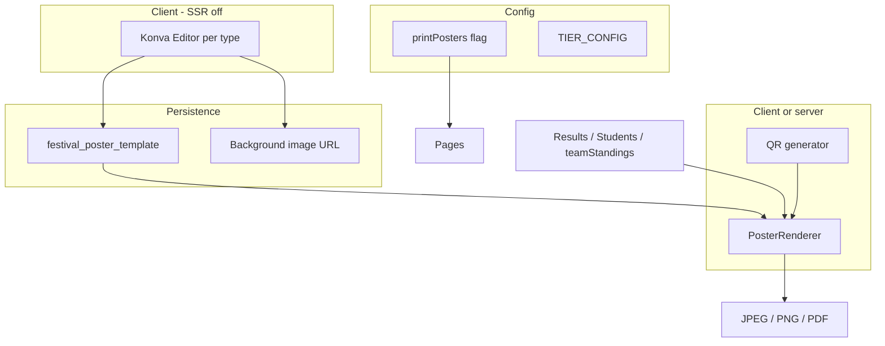

# Harness: Customizable print posters (Konva)

**Status:** Requirements source of truth for the poster editor program.  
**Workflow:** Implement one file under `issues/` at a time; see [README.md](./README.md).

---

## 1. Product summary

Festivals need a **visual template editor** and **print/export** for three poster types:

| Type | Icon | Purpose | Saved as |
|------|------|---------|----------|
| **Result poster** | 🏅 | Classic per-result poster: winner slots, category, programme (item) title | One template per festival (`RESULT`) |
| **Team points poster** | 🏅 | Leaderboard-style: team names + total points | **Separate** template (`TEAM_POINTS`) — not shared with result poster |
| **Candidate card** | 🪪 | Printable card: chest number, team, QR code | One template per festival (`CANDIDATE_CARD`), **1050×600 px** |

Each type supports:

- Background image upload (“No file chosen” → file picker)
- Draggable text/image layers (Konva)
- **Data bindings** filled at export time from live festival data

---

## 2. Plan entitlement (STANDARD + PRO)

| Capability | BASIC | STANDARD | PRO |
|------------|-------|----------|-----|
| Poster templates + editor | ❌ | ✅ | ✅ |
| Per-student candidate card export | ❌ | ✅ | ✅ |
| Per-programme result poster export | ❌ | ✅ | ✅ |
| Team points poster export | ❌ | ✅ | ✅ |
| Bulk export (all students / all programmes / one team-points PDF) | ❌ | ❌ | ✅ |

**Harness decision:** Introduce one feature flag: **`printPosters`** — `true` on STANDARD and PRO, `false` on BASIC.

PRO-only bulk behavior reuses the spirit of existing **`bulkCertificateGeneration`** (PRO-only); poster bulk can gate on that flag **or** a dedicated `bulkPosterExport` — implementers should align with issue `011`.

Related existing flags (unchanged unless issue says otherwise):

- `qrCodes` — QR Codes page access (STANDARD+); candidate export lives there but gates on **`printPosters`** for template/custom layout.
- `autoCertificates` — separate product surface; posters are not the same as auto-cert PDFs unless merged later.
- `customCertificateTemplates` — PRO; optional future alias if marketing wants one name; **this program uses `printPosters` for STANDARD+PRO editor access.**

---

## 3. Domain data bindings

### 3.1 Result poster (per programme)

**Source:** Published `result` rows + `programme` + `category` + assignment → student/group.

| Binding key | Source |
|-------------|--------|
| `festivalName` | `festival.name` |
| `programmeName` | `programme.name` |
| `categoryName` | `category.name` |
| `winner{N}Name` | Assignment display name, `position === N`, published only |
| `winner{N}Team` | Group/team label on assignment |
| `winner{N}Grade` | `result.grade` |
| `winner{N}Points` | `result.points` (+ award if product rules say so) |

Template defines **N winner slots** (e.g. 3). Empty slot → hide layer or show em dash.

**Entry UI:** Event-works **Results** (after publish) — “Download result poster”.

### 3.2 Team points poster (festival-wide)

**Source:** Prefer `festival.teamStandings` jsonb when present; else aggregate published results by team (same approach as `ResultsList.tsx` team tab).

| Binding key | Source |
|-------------|--------|
| `festivalName` | `festival.name` |
| `generatedAt` | Export timestamp (formatted) |
| `teamRows` | Repeating: rank, name, points |

**Entry UI:** Event-works **Leaderboard** and/or settings posters hub.

### 3.3 Candidate card (per student)

**Source:** `student`, `group`, chest number, QR payload.

| Binding key | Source |
|-------------|--------|
| `festivalName` | `festival.name` |
| `studentName` | `student.name` |
| `chestNumber` | `student.chestNumber` |
| `teamName` | `group.name` |
| `qrCode` | `getQrCodeContent(student)` from `@/features/students/services/student-profile-url` |

**Canvas:** 1050×600 px (design + export pixel ratio documented in renderer issue).

**Entry UI:** Pre-works **QR Codes** — replace hardcoded 400×500 JPEG in `QrCodesClient.tsx` when template exists.

---

## 4. How Greenroom implements features (style guide)

Follow these patterns so poster work matches the rest of the codebase.

### 4.1 Layout

```
src/
  app/dashboard/[slug]/...          # Server pages: load festival, gate, pass props
  components/festival/...           # Client UI (large interactive surfaces)
  features/<domain>/
    actions/*.actions.ts              # "use server" mutations/queries
    services/*.service.ts             # Business rules
    repositories/*.repository.ts      # DB access (where used)
    hooks/use-*.ts                  # TanStack Query wrappers
  core/database/schema.ts           # Drizzle tables
  config/pricing.ts                 # TIER_CONFIG feature booleans
  config/plan-features.config.ts    # Feature metadata labels
```

### 4.2 Plan gating (required on every slice)

1. **Config:** `TIER_CONFIG[tier].features.printPosters` in `src/config/pricing.ts`.
2. **Labels:** Register in `src/config/plan-features.config.ts`.
3. **Server pages:** `getEffectiveFeatureEnabled(festival.tier, "printPosters")` → `redirect` or `notFound` (see `qr-codes/page.tsx`).
4. **Server actions:** Same check + `assertFestivalAccess` + `useFestivalReadOnly` / expiry writable checks where mutations occur.
5. **Client:** `useFeature("printPosters")` / `FeatureGate` for buttons.

Prefer **`getEffectiveFeatureEnabled`** on new code (Super Admin overrides). Legacy code uses `FeatureService` — do not mix within one new flow.

### 4.3 Server actions

- File suffix: `*.actions.ts`, top line `"use server"`.
- Return `{ success: true, ... } | { success: false, error: string }`.
- `revalidatePath` for affected dashboard routes after template save.
- Auth: `getSession()` + `assertFestivalAccess(session, festivalId)`.

### 4.4 UI stack

- **React 19**, **Next.js 16** App Router.
- **shadcn/ui** (`Button`, `Card`, `Dialog`, `Tabs`, etc.).
- **Tailwind** + existing design tokens (`docs/DESIGN_SYSTEM.md`).
- **sonner** toasts for success/error.
- **Client components** for Konva; load with `dynamic(..., { ssr: false })`.

### 4.5 Persistence

- **Drizzle** + PostgreSQL; migrations under `drizzle/`.
- New table recommended: `festival_poster_template` (see issue 001).
- Background images: uploaded URL stored on template; count bytes via `StorageUsageService` against `limits.storageMB`.

### 4.6 Rendering / export

- **Design:** `konva` + `react-konva` (MIT).
- **Persist:** Konva stage JSON (`stage.toJSON()` / `Konva.Node.create`).
- **Export:** `stage.toDataURL({ pixelRatio })` → JPEG/PNG; bulk PDF via **jspdf** (already used in `qr.actions.ts`, `festival-expiration.service.ts`).
- **QR:** `qrcode` package (already in `QrCodesClient`, `qr.actions.ts`).

### 4.7 What exists today (replace / extend)

| Area | Current behavior |
|------|------------------|
| `QrCodesClient.tsx` | Fixed 400×500 canvas poster; not customizable |
| `qr.actions.ts` | Bulk PDF with small QR cells, not candidate card layout |
| Results | Scoring/publish in `ResultsManagementClient`; no poster export |
| Leaderboard | `leaderboard.service.ts` + page; no poster export |
| Certificates | `autoCertificates` flag; no Konva editor in repo yet |

---

## 5. Technical architecture



### 5.1 Template types (enum)

- `RESULT`
- `TEAM_POINTS`
- `CANDIDATE_CARD`

Unique constraint: `(festivalId, type)`.

### 5.2 Suggested module home

```
src/features/posters/
  actions/poster-template.actions.ts
  actions/poster-export.actions.ts   # optional; bulk may stay client-only initially
  services/poster-renderer.service.ts
  services/poster-bindings.service.ts
  types/poster-template.types.ts
src/components/festival/posters/
  PosterEditor.tsx
  PosterPreview.tsx
  PostersSettingsClient.tsx
```

### 5.3 Bindings contract

Templates store:

- `konvaJson`: serialized stage
- `width`, `height`
- `meta`: `{ winnerSlotCount?: number }` per type

Renderer maps binding keys → text/image nodes (by `name` or custom `attrs.bindingKey`).

---

## 6. Non-goals (this program)

- BASIC tier access
- Polotno SDK integration
- Public anonymous template editing
- Landing page builder (`landingPageBuilder`) — separate PRO feature
- Replacing auto-certificate PDF pipeline unless explicitly merged later

---

## 7. Acceptance (program-level)

- [ ] STANDARD and PRO festivals can open poster editors and save three separate templates
- [ ] BASIC cannot access poster routes/actions
- [ ] Candidate card exports at 1050×600 with chest number, team, QR
- [ ] Result poster fills winner slots from published results for a programme
- [ ] Team points poster uses separate template and team standings data
- [ ] PRO can bulk-export posters per issue 011
- [ ] Storage and read-only/expired festival rules respected on mutations

---

## 8. Issue map

See [README.md](./README.md) for ordered tickets. Dependencies: **001 → 002 → 003** → (004–005 ∥ 006–007 ∥ 008–009) → **010** → **011**.
