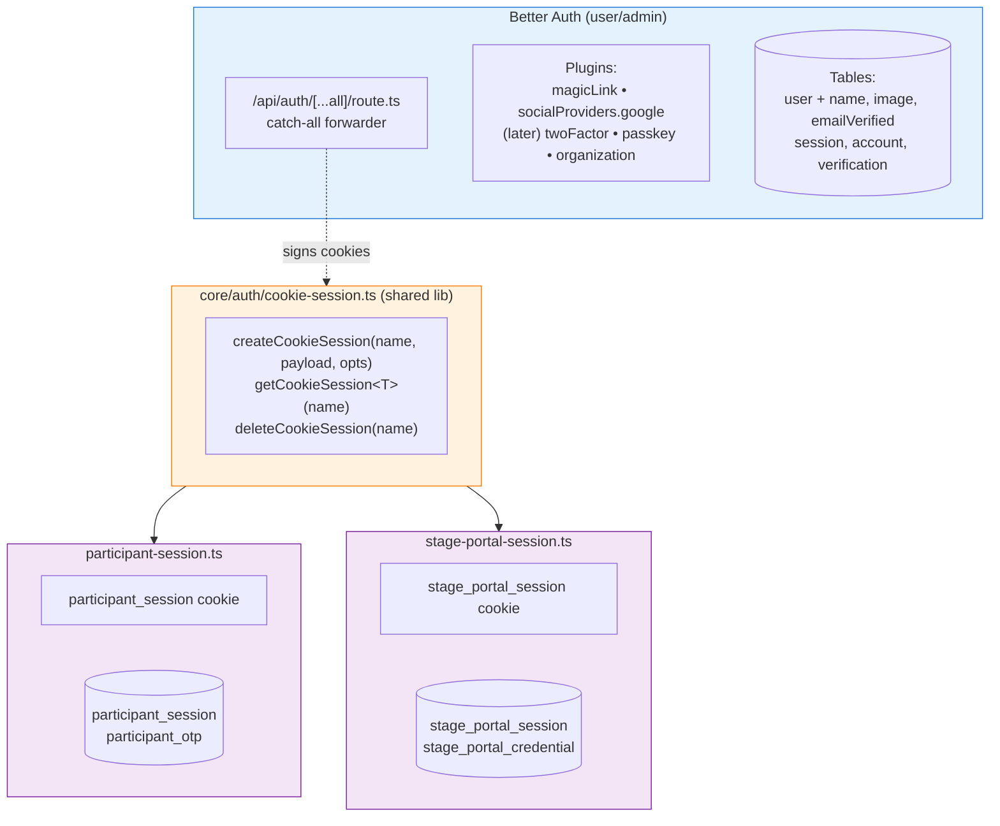

# Auth Foundation — Migrate to Better Auth + Add Google Sign-In

## Status

- **Created**: 2026-08-05
- **Status**: In Progress — PR 1 + PR 2 + PR 3 complete, PR 4 pending
- **Priority**: High
- **Complexity**: High
- **Target**: Production
- **Phasing**: 4 PRs
- **Blocks**: 2FA / passkeys / organizations (per roadmap)

## Summary

Replace the hand-rolled JWT + magic-link auth foundation for user/admin with [Better Auth](https://www.better-auth.com), while adding **Google sign-in** as a second provider. Keep participant and stage portal auth on their own custom session tables (different principal shape — no `user` row), but extract a shared `core/auth/cookie-session.ts` library so the three session mechanisms don't duplicate the cookie-signing code. Add **2FA, passkeys, and organizations** in a later PR.

The original ask was "add Continue with Google." After comparing `arctic` vs `googleapis` vs `Better Auth` against the existing architecture, the right call is to migrate the whole user/admin auth foundation to Better Auth, since the library is **free OSS, MIT-licensed, fully self-hosted** (sessions in our existing Postgres — no SaaS, no per-MAU cost) and gets us Google OAuth, magic link, 2FA, passkeys, and account linking for the same effort as building one of those individually.

---

## Locked Decisions

| # | Question | Decision |
|---|---|---|
| 1 | Library | `better-auth` (open-source, MIT, self-hosted) |
| 2 | Scope | Better Auth owns **user/admin auth only**. Participant + stage portal use a shared cookie-session lib. |
| 3 | Google OAuth | `socialProviders.google` in Better Auth config. Auto-link by verified email. |
| 4 | Magic link | Replaced with Better Auth's `magicLink` plugin. Uses existing `sendMagicLinkEmail` via the plugin's `sendMagicLink` hook. |
| 5 | Existing `user` table | Same `user` table; Better Auth adds `name`, `image`, `emailVerified` columns. All Greenroom columns preserved (`globalRole`, `fullName`, `displayName`, `accountType`, `institutionId`, `isActive`, `timezone`). |
| 6 | Auto-link Google account | Yes, if Google's `email_verified=true` matches an existing user. Audit-logged as `LINK_GOOGLE_ACCOUNT`. |
| 7 | Domain policy | Any Google account. |
| 8 | Session secret | Reuse current `JWT_SECRET` as `BETTER_AUTH_SECRET` to preserve in-flight participant/stage portal cookies. |
| 9 | Feature flag | PR 1 ships Better Auth infra behind `AUTH_PROVIDER` env. Old magic link stays default. PR 2 flips default. PR 3 removes old code. |
| 10 | Existing user migration | Backfill `emailVerified=true` and `name=fullName ?? email` for all existing users in the migration script. |
| 11 | Audit log | `actorRole` adapter maps Better Auth's role to Greenroom's `USER`/`SUPER_ADMIN`. New events: `SIGN_IN_GOOGLE`, `LINK_GOOGLE_ACCOUNT`. |
| 12 | Test infrastructure | Hard dependency on ISSUE-35 (testcontainers Postgres). |
| 13 | PR 4 scope | 2FA (TOTP + email OTP) minimum. Passkeys and orgs confirmed on roadmap. |
| 14 | ts-rest contracts | `authContract` is dead code — removed in PR 2. The real client uses REST via `src/lib/api-client.ts`, not the ts-rest client. |
| 15 | Magic-link email | Fix the 15-min vs 30-min mismatch in the same PR that touches the email sender. |

---

## Background — why migrate

### Current state
- Hand-rolled JWT auth (HS256, `JWT_SECRET` via `jose`).
- Magic link via `resend` + a custom `magicLinkToken` DB table.
- Three parallel session systems: user/admin (JWT in `session` cookie), participant (JWT in `participant_session` cookie + `participant_session` DB row), stage portal (JWT in `stage_portal_session` cookie + `stage_portal_session` DB row).
- 100+ `getSession()` call sites, ~50 `assertFestivalAccess()` call sites.
- No middleware, no global auth check — every page and route hand-rolls its own.
- No 2FA, no passkeys, no organizations, no Google OAuth.
- Sessions are **non-revocable** for 30 days (stolen token = 30-day access).

### The ask
"Add Continue with Google" — but the simplest, lowest-risk way to add Google to the current architecture is to migrate to Better Auth, which gives us Google + magic link + 2FA + passkeys + organizations in one cohesive system. Building the same on top of the current custom auth would require a separate library (`googleapis` or `arctic`) plus a custom session primitive — and we'd still have to bolt on 2FA and passkeys later.

### Why Better Auth specifically
- **Open source, MIT, self-hosted.** No SaaS, no per-MAU, no "Better Auth Cloud". Sessions live in our existing Postgres.
- **Framework-agnostic core** with first-class Next.js support. If we ever leave Next.js, the auth layer doesn't change.
- **Drop-in schema additions** via `npx @better-auth/cli generate`. We keep our `user` table — Better Auth just adds three columns and three new tables.
- **Built-in account linking.** A user who signed up with magic link can later sign in with Google; Better Auth merges the accounts by verified email.
- **Active upstream** — security patches and new providers land automatically.

### What this is NOT
- This is **not** a rewrite. The 100+ `getSession()` call sites stay; only the body of `getSession()` changes (PR 3). The route paths stay (`/api/v1/*`).
- This is **not** a participant/portal rewrite. Participant and stage portal auth stay custom — they have a fundamentally different principal shape (no `user` row, festival-scoped, short-lived).
- This is **not** a security regression. Sessions become **revocable** (DB-backed, not stateless JWT), which is strictly better.

---

## Current architecture (compact reference)

### Auth touchpoint inventory
- **JWT signing/verification**: `src/core/auth/session.ts` (only file using `jose`)
- **Magic link tokens**: `src/core/auth/magic-link.ts` + `magicLinkToken` table
- **Participant session**: `src/core/auth/participant-session.ts` + `participant_session` table + `participant_otp` table
- **Stage portal session**: `src/core/auth/stage-portal-session.ts` + `stage_portal_session` table + `stage_portal_credential` table
- **Post-auth routing**: `src/core/auth/routing.ts` (`getPostAuthRoute`)
- **Festival access guard**: `src/core/auth/assert-festival-access.ts` (47 call sites)
- **API handler factory**: `src/api/lib/create-handler.ts` (decodes JWT, exposes `ctx.user`)
- **Audit log**: `src/features/auth/services/audit-log.service.ts` (35 audit actions, reads `session.role`)
- **User repository**: `src/features/auth/repositories/user.repository.ts`
- **Client hooks**: `src/features/auth/hooks/use-auth.ts`, `use-current-user.ts`
- **Email sender**: `src/core/integrations/email.ts` (public shim) → `core/integrations/email/send.ts` (uses `resend`)

### Auth endpoints
| Endpoint | Method | Purpose | System |
|---|---|---|---|
| `/api/v1/auth?action=magic-link` | POST | Issue magic link token | User/admin |
| `/api/v1/auth?action=verify-magic-link` | POST | Verify token, create user, create JWT session | User/admin |
| `/api/v1/auth?action=logout` | POST | Delete session cookie | User/admin |
| `/api/v1/auth` | GET | Return current user | User/admin |
| `/api/v1/invitations/accept` | POST | Auto-login after accepting invite | User/admin |
| `/api/v1/participant-login/request-access` | POST | Issue OTP, email via Resend | Participant |
| `/api/v1/participant-login/verify-otp` | POST | Verify OTP, create session | Participant |
| `/api/v1/participant-login/logout` | POST | Delete participant session | Participant |
| (no dedicated endpoints) | — | Auth via `getStagePortalSessionFromCookie()` in pages + server actions | Stage portal |
| `/api/v1/cron` | GET | Bearer `CRON_SECRET` | Cron |
| `/api/v1/super-admin/*` | various | Session + `role === "SUPER_ADMIN"` | Super-admin |

**Total: 4 dedicated user/participant auth routes + 1 cron + 3 super-admin.**

---

## Target architecture (after PR 3)



Three session systems, **one** signing library, **one** cookie shape convention.

---

## Auth model comparison (current vs Better Auth)

| | Current | Better Auth (after PR 3) |
|---|---|---|
| Session storage | Stateless JWT (no DB row) | DB-backed (one `session` row per device) |
| Revocation | Not possible | `auth.api.revokeSession()` + DB delete |
| Validation cost | `jose.jwtVerify` only (CPU) | DB lookup + token compare |
| Expiry | Baked into JWT, fixed 30d | Per-session in DB, extendable |
| Multi-device | One token per user | One session row per (user, device) |
| Roles | `globalRole: USER \| SUPER_ADMIN` (custom enum) | Better Auth `role: user \| admin` (default) + `additionalFields.globalRole` for our enum |
| Google OAuth | None | `socialProviders.google` |
| Magic link | Custom (`magicLinkToken` table + `resend`) | `magicLink` plugin, calls our existing `sendMagicLinkEmail` |
| 2FA / passkeys | None | Plugins (PR 4) |
| Account linking | None | Built-in (by verified email) |
| Cookie name | `session` (user/admin), `participant_session`, `stage_portal_session` | Better Auth uses its own cookie name; participant/stage portal keep theirs via the shared lib |
| Signing key | `JWT_SECRET` (HS256, jose) | `BETTER_AUTH_SECRET` (reuses current value of `JWT_SECRET`) |

---

## Phasing

### PR 1: Foundation
**Goal:** Install Better Auth, generate schema additions, add the catch-all route, prove the schema works. **Old magic link still works** (default). Better Auth magic link works when `AUTH_PROVIDER=better-auth`.

**Tasks**
1. `npm install better-auth nanostores`
2. Create `src/core/auth/better-auth/auth.ts` with `betterAuth({...})` config:
   - `drizzleAdapter(db, { provider: "pg", schema })`
   - `emailAndPassword: { enabled: false }` (we don't want password sign-in — magic link + Google only)
   - `magicLink` plugin with `sendMagicLink` hook calling existing `sendMagicLinkEmail` from `src/core/integrations/email.ts:25-33`
   - `socialProviders.google` with `clientId: process.env.GOOGLE_CLIENT_ID`, `clientSecret: process.env.GOOGLE_CLIENT_SECRET` (Better Auth enabled in PR 2, not PR 1)
   - `user.additionalFields` for `globalRole`, `fullName`, `displayName`, `accountType`, `institutionId`, `isActive`, `timezone`
   - `session.cookieCache: { enabled: true, maxAge: 5 * 60 }` to reduce DB hits on hot paths
3. Create `src/core/auth/better-auth/client.ts` with `createAuthClient({...})` (used in PR 2)
4. Run `npx @better-auth/cli generate`; **hand-review** the generated SQL diff
5. Hand-edit the generated migration if needed (especially `emailVerified` default for backfill)
6. Apply migration to dev DB
7. Add `/api/auth/[...all]/route.ts` to forward to the Better Auth handler
8. Add `BETTER_AUTH_SECRET`, `BETTER_AUTH_URL`, `BETTER_AUTH_TRUSTED_ORIGINS` to `.env.example`
9. Add `BETTER_AUTH_SECRET` to `src/test/setup.ts` (replacing `JWT_SECRET`)
10. Backfill SQL in the same migration: `UPDATE "user" SET "name" = COALESCE("fullName", split_part("email", '@', 1)), "emailVerified" = TRUE;`
11. Wire `user_login_event` table to Better Auth's `signIn` event hook (Bonus B17 from the explore report — opportunistic cleanup)
12. Fix magic-link email 15-min vs 30-min mismatch: pass `expiresInMinutes: 30` from the route (Bonus, the route currently doesn't pass it)
13. **Feature flag** `process.env.AUTH_PROVIDER` — when `"better-auth"`, the login form renders Better Auth UI; default `"jwt"` keeps the old code. The flag is checked in `MagicLinkRequestForm.tsx` and `login/page.tsx`.

**Verification**
- `npm run lint` clean
- `npm run test:unit` clean (existing tests still pass)
- New integration test: with `AUTH_PROVIDER=better-auth`, magic-link end-to-end (send → verify → session set), real DB
- New integration test: default flag → old magic link still works (regression guard)
- Manual: visit `/login`, send magic link, click link, confirm session set

**Risk: Low.** Additive — no behaviour change in production.

---

### PR 2: UI switch + Google OAuth ships
**Goal:** Flip the UI to Better Auth's client, add "Continue with Google" button, remove the obsolete `/login/verify/[token]/page.tsx`. Flip the feature flag default to `better-auth`.

**Tasks**
1. Refactor `src/components/auth/MagicLinkRequestForm.tsx` to use `authClient.signIn.magicLink({ email, callbackURL: "/profile" })`
2. Add "Continue with Google" button (Google "G" SVG, "or" divider, calls `authClient.signIn.social({ provider: "google", callbackURL: "/profile" })`)
3. Update `src/features/auth/hooks/use-auth.ts`:
   - Remove `useSendMagicLink`, `useVerifyMagicLink` (Better Auth client does both)
   - Add `useLogout` calling `authClient.signOut()`
   - Add `useSession` wrapping Better Auth's `useSession`
   - Keep `useCompletePersonalOnboarding` / `useCompleteInstitutionalOnboarding` (underlying onboarding routes stay)
4. Remove `src/app/login/verify/[token]/page.tsx` (Better Auth owns the verify page)
5. Update `src/components/auth/LogoutButton.tsx` to call Better Auth's signOut
6. Update `src/components/layout/Navbar.tsx` and `src/components/admin/AppSidebar.tsx` to use Better Auth's `useSession`
7. Enable `socialProviders.google` in `auth.ts` (set to enabled in config)
8. Add audit log entries `SIGN_IN_GOOGLE` and `LINK_GOOGLE_ACCOUNT` to `AuditAction` union
9. Flip `AUTH_PROVIDER` default to `better-auth`. Keep the flag (deleted in PR 3).
10. Delete dead code: `src/contracts/auth.contract.ts`, `src/api/contracts/auth.ts`, `src/api/contracts/admin.ts`, `src/features/auth/hooks/use-users.ts`
11. Fix the `redirect("/auth/login")` typo in `dashboard/[slug]/settings/page.tsx:26` (should be `/login`)

**Verification**
- `npm run lint` clean
- `npm run test:unit` clean
- `useLogout` integration test
- Magic link flow end-to-end (real Postgres, mocked Resend)
- Google OAuth flow with mocked Google userinfo
- Regression: every protected page still renders for users with the old JWT cookie (they get logged out on first request, then sign in again with magic link or Google)

**Risk: Medium.** First user-facing change. Google sign-in goes live in production after this PR. The old JWT cookies are still valid (default branch in the flag), so users don't see any change until PR 3.

---

### PR 3: Session swap (high risk)
**Goal:** Replace the JWT-based `getSession()` with Better Auth's `auth.api.getSession({ headers })`. Extract a shared `core/auth/cookie-session.ts` library. Remove all old auth code, `jose` dep, and `JWT_SECRET` env. Touches every protected route and every page with an auth gate.

**Tasks**
1. Create `src/core/auth/cookie-session.ts` shared library:
   ```ts
   createCookieSession<T>(name, payload, opts)   // signs cookie with BETTER_AUTH_SECRET (HS256)
   getCookieSession<T>(name) → T | null         // verifies and returns typed payload
   deleteCookieSession(name)                    // clears cookie
   ```
2. Refactor `src/core/auth/participant-session.ts` to use the shared lib (no behaviour change)
3. Refactor `src/core/auth/stage-portal-session.ts` to use the shared lib (no behaviour change)
4. Update `src/api/lib/create-handler.ts`:
   - Replace `decrypt(jwt)` with `auth.api.getSession({ headers: request.headers })`
   - Change `HandlerContext.user` shape from `SessionPayload` (custom `{userId, role, expires}`) to Better Auth's `Session.user` (full user row + Better Auth's `session` field)
   - Update `createAdminHandler` to check Better Auth's `globalRole` via the `additionalFields` adapter
5. Update every call site that reads `session.userId` → `session.user.id`
6. Update every call site that reads `session.role` → read from `session.user.globalRole` (Better Auth's `additionalFields`)
7. Update `src/core/auth/current-user.ts` to use `auth.api.getSession({ headers })`
8. Update `src/core/auth/assert-festival-access.ts` to take the new session shape
9. Update audit log: `actorRole = mapBetterAuthRoleToGlobalRole(session.user.globalRole)` — new helper in `src/features/auth/services/audit-log.service.ts`
10. Delete `src/core/auth/session.ts` (old JWT)
11. Delete `src/app/api/v1/auth/route.ts` (replaced by Better Auth's catch-all)
12. Delete `jose` from `package.json` (`npm uninstall jose`)
13. Delete `JWT_SECRET` from `.env.example` (use `BETTER_AUTH_SECRET`)
14. Update `src/test/setup.ts` to set `BETTER_AUTH_SECRET` instead of `JWT_SECRET`
15. Update `src/lib/api-client.ts`: remove `api.auth.sendMagicLink` / `verifyMagicLink` / `me` / `v1Me` / `completeOnboarding` wrappers; keep `v1Logout` until all logout paths are migrated, then delete
16. Remove `AUTH_PROVIDER` feature flag (Better Auth is now the only path)
17. Remove the `assertFestivalAccess` in-memory cache (Better Auth's session is fast enough; role changes propagate immediately)
18. Update `src/features/auth/repositories/user.repository.ts`: drop `createUser` if no callers remain (Better Auth owns user creation now); keep `findUserById`, `findUserByEmail`, `updateUser` for non-auth contexts (admin, profile)
19. Audit the `axios` 401 interceptor in `src/lib/api-client.ts:15-23` — confirm it doesn't fire during the Better Auth flow's expected 401s (e.g. `useSession` on the login page)
20. Update `src/core/auth/README.md` (new file): document why participant and stage portal stay custom, and how the shared lib fits in

**Verification**
- `npm run lint` clean
- `npm run test:unit` clean
- `npm run test:integration` covers every route handler from the inventory below
- Regression: participant login still works (shared lib path)
- Regression: stage portal login still works (shared lib path)
- Regression: every dashboard page renders for a logged-in user
- Regression: every page redirects to `/login` for a logged-out user
- Manual: invite accept flow (`/api/v1/invitations/accept`) still auto-logs in (uses Better Auth's `signIn` after creating user)

**Risk: High.** Every `getSession()` caller breaks if missed. Mitigation: TypeScript strict mode + CI grep for `session\.userId\b` and `session\.role\b` (should return 0 hits after PR 3).

---

### PR 4: 2FA / passkeys / organizations
**Goal:** Add Better Auth's `twoFactor`, `passkey`, and `organization` plugins. UI in profile settings.

**Tasks**
1. Add `twoFactor()` plugin to `betterAuth({...})` config (TOTP + email OTP)
2. Run `npx @better-auth/cli generate`; apply migration (`twoFactor` table)
3. Add `passkey()` plugin if passkeys confirmed on roadmap
4. Add `organization()` plugin if orgs confirmed on roadmap
5. Profile page UI: enable/disable TOTP, email OTP, backup codes (`/profile/2fa`)
6. Sign-in flow: if user has `twoFactorEnabled`, redirect to `/auth/2fa` challenge page
7. (Passkey) Add "Add passkey" UI in profile
8. (Orgs) Build team-management UI; map to existing `festivalMember` table or use Better Auth's org model (decision: depends on org structure)

**Verification**
- 2FA end-to-end test (real DB, mocked TOTP)
- Sign-in flow: 2FA challenge page works
- (Passkey / orgs) manual + integration

**Risk: Low.** Additive — existing flows unchanged.

---

## Files

### Delete
| File | Reason | PR |
|---|---|---|
| `src/core/auth/session.ts` | Old JWT session (Better Auth replaces) | 3 |
| `src/core/auth/magic-link.ts` | Better Auth owns it | 2 |
| `src/app/api/v1/auth/route.ts` | Replaced by Better Auth catch-all | 3 |
| `src/app/login/verify/[token]/page.tsx` | Better Auth owns the verify page | 2 |
| `src/contracts/auth.contract.ts` | Dead code — never imported | 2 |
| `src/api/contracts/auth.ts` | Dead code | 2 |
| `src/api/contracts/admin.ts` | Dead code (no `/api/v1/users` endpoint exists) | 2 |
| `src/features/auth/hooks/use-users.ts` | Dead code (endpoint missing) | 2 |
| `src/api/lib/create-handler.ts` (old version) | Rewritten for Better Auth | 3 |

### Add
| File | Purpose | PR |
|---|---|---|
| `src/core/auth/better-auth/auth.ts` | `betterAuth({...})` config | 1 |
| `src/core/auth/better-auth/client.ts` | `createAuthClient({...})` | 1 |
| `src/app/api/auth/[...all]/route.ts` | Catch-all forwarder | 1 |
| `src/core/auth/cookie-session.ts` | Shared lib for participant + stage portal | 3 |
| `src/core/auth/README.md` | Documents the three session systems + shared lib | 3 |
| `src/app/auth/2fa/page.tsx` | 2FA challenge page | 4 |
| `src/components/auth/TwoFactorSetup.tsx` | 2FA enable/disable UI | 4 |
| `src/core/auth/better-auth/auth.test.ts` | Better Auth config smoke test | 1 |
| `src/core/auth/cookie-session.test.ts` | Shared lib unit test | 3 |
| Integration tests for: magic-link, Google OAuth, every route handler | 1, 2, 3 |

### Modify (by area, count, notes)
| Area | Count | Notes |
|---|---|---|
| `src/core/auth/*` | 6 files | 5 deleted, 1 added, 4 refactored |
| `src/api/lib/*` | 2 files | `create-handler.ts` rewritten, `index.ts` updated |
| `src/app/api/v1/*` | ~50 route files | Most use `createHandler` — auto-updated when factory changes. ~13 raw routes need manual updates. |
| `src/app/api/auth/*` (catch-all) | 1 file (new) | PR 1 |
| `src/app/api/profile/festivals/*` | 2 files | Bypass factory — manual session extraction in PR 3 |
| `src/app/**/page.tsx` and `layout.tsx` | ~25 server components | `getSession` / `getCurrentUser` calls become `auth.api.getSession({ headers })` |
| `src/features/auth/hooks/*` | 3 files | Rewritten for Better Auth client |
| `src/features/auth/actions/*` | 3 files | `getSession` callers updated |
| `src/features/auth/services/audit-log.service.ts` | 1 file | `actorRole` mapping function added; new `SIGN_IN_GOOGLE` / `LINK_GOOGLE_ACCOUNT` actions |
| `src/features/auth/repositories/user.repository.ts` | 1 file | `createUser` callers (if any) migrate to Better Auth's `signUp` |
| `src/components/auth/*` | 4 files | UI rewritten |
| `src/components/layout/Navbar.tsx`, `admin/AppSidebar.tsx` | 2 files | Use Better Auth's `useSession` |
| `src/lib/api-client.ts` | 1 file | Remove magic-link wrappers; audit 401 interceptor |
| `src/core/database/schema.ts` | 1 file | Add columns + new tables (PR 1) |
| `drizzle/*` (new migration files) | 1–3 files | Generated by `drizzle-kit` and Better Auth CLI |
| `package.json` | 1 file | `+ better-auth`, `+ nanostores`, `- jose` |
| `.env.example` | 1 file | `+ BETTER_AUTH_SECRET`, `+ BETTER_AUTH_URL`, `+ BETTER_AUTH_TRUSTED_ORIGINS`, `+ GOOGLE_CLIENT_ID`, `+ GOOGLE_CLIENT_SECRET`, `- JWT_SECRET` |
| `src/test/setup.ts` | 1 file | `JWT_SECRET` → `BETTER_AUTH_SECRET` |
| `src/core/integrations/email/kinds/magic-link.tsx` | 1 file | Pass `expiresInMinutes: 30` from the route (fix 15-min default) |

**Total: ~110 files touched across all 4 PRs. The bulk (~100) is in PR 3.**

---

## Database schema changes

### New tables (Better Auth, generated)
| Table | Columns | Notes |
|---|---|---|
| `session` | `id`, `userId` (FK), `token`, `expiresAt`, `ipAddress`, `userAgent`, `createdAt`, `updatedAt` | One row per (user, device). Revocable. |
| `account` | `id`, `userId` (FK), `accountId`, `providerId` (`"google"`, `"credential"`, etc.), `accessToken`, `refreshToken`, `idToken`, `expiresAt`, `password` (nullable) | One row per linked identity per user. Enables account linking. |
| `verification` | `id`, `identifier`, `value`, `expiresAt`, `createdAt`, `updatedAt` | Magic link OTPs, email verifications, password resets. Replaces `magicLinkToken`. |

### Columns added to `user` (generated)
| Column | Type | Default | Backfill |
|---|---|---|---|
| `name` | `text` | `''` | `COALESCE("fullName", split_part("email", '@', 1))` |
| `image` | `text` | `null` | (none — null for existing users) |
| `emailVerified` | `boolean` | `false` | `true` for all existing users (they all received a magic link at some point) |

### Preserved on `user`
All existing columns stay: `id`, `email`, `globalRole`, `fullName`, `displayName`, `accountType`, `institutionId`, `isActive`, `timezone`, `createdAt`, `updatedAt`. The `globalRole` column becomes Better Auth's `additionalFields.globalRole` — same data, exposed via Better Auth's session shape.

### Preserved tables (no change)
`participant_session`, `participant_otp`, `stage_portal_session`, `stage_portal_credential`, `audit_log`, `institution`, `festivalMember`, `payment`, `pendingInvitation`, `user_purchase_summary`, `festival_category_preference`, `user_login_event` (now populated by Better Auth's `signIn` hook).

### Dropped tables
- `magicLinkToken` (replaced by Better Auth's `verification`)

### Backfill SQL (in the same migration)
```sql
UPDATE "user"
SET
  "name" = COALESCE("fullName", split_part("email", '@', 1)),
  "emailVerified" = TRUE;
```

### Drizzle migration files
- PR 1: `drizzle/0022_better_auth_foundation.sql` (generated, hand-reviewed)
- PR 4: `drizzle/0023_better_auth_2fa.sql` (if 2FA lands)

---

## Environment variables

### Add
| Variable | Value | Required? | Replaces |
|---|---|---|---|
| `BETTER_AUTH_SECRET` | `openssl rand -hex 32` (reuse current `JWT_SECRET` value in prod) | Yes (production) | `JWT_SECRET` |
| `BETTER_AUTH_URL` | `http://localhost:3000` (dev), `https://greenroomm.vercel.app` (prod) | Yes | New |
| `BETTER_AUTH_TRUSTED_ORIGINS` | Same as URL (comma-separated for multiple) | Recommended | New |
| `GOOGLE_CLIENT_ID` | From Google Cloud Console | Yes (for Google sign-in, PR 2+) | New |
| `GOOGLE_CLIENT_SECRET` | From Google Cloud Console | Yes (for Google sign-in, PR 2+) | New |
| `AUTH_PROVIDER` | `"jwt"` (default PR 1) → `"better-auth"` (PR 2+) → deleted (PR 3) | PR 1+ only | New |

### Remove
| Variable | Removed in |
|---|---|
| `JWT_SECRET` | PR 3 (replaced by `BETTER_AUTH_SECRET`) |

### Unchanged
`CRON_SECRET`, `DATABASE_URL`, `DATABASE_URL_UNPOOLED`, `RESEND_API_KEY`, `EMAIL_FROM`, Razorpay vars, Cloudinary vars, `NEXT_PUBLIC_APP_URL`.

### `.env.example` after PR 3
```env
# -----------------------------------------------------------------------------
# Auth (Better Auth)
# -----------------------------------------------------------------------------
# Generate per environment:
#   openssl rand -hex 32
BETTER_AUTH_SECRET=<generate-a-secret-at-least-32-characters-long>
BETTER_AUTH_URL=http://localhost:3000
BETTER_AUTH_TRUSTED_ORIGINS=http://localhost:3000

# Google OAuth (https://console.cloud.google.com/apis/credentials)
# Authorized redirect URI: ${BETTER_AUTH_URL}/api/auth/callback/google
GOOGLE_CLIENT_ID=
GOOGLE_CLIENT_SECRET=
```

---

## Google Cloud Console setup (one-time, manual)

1. Create / select Google Cloud project for Greenroom
2. **APIs & Services** → **OAuth consent screen** — External, scopes: `openid email profile`, add test users
3. **APIs & Services** → **Credentials** → **Create OAuth client ID** — Web application
4. **Authorized redirect URIs**:
   ```
   http://localhost:3000/api/auth/callback/google
   https://greenroomm.vercel.app/api/auth/callback/google
   ```
5. Copy `Client ID` and `Client secret` into `.env` / Vercel env vars
6. Do **not** commit the client secret. If leaked, rotate via Console → **Reset secret**

**For Preview deploys on Vercel:** add a redirect URI per preview URL, or test Google sign-in only on local + production. Wildcards are not supported in Google OAuth client config.

---

## Risks

| # | Risk | Likelihood | Impact | Mitigation |
|---|---|---|---|---|
| 1 | Schema generation surprise — Better Auth CLI may produce unexpected DDL (wrong default for `emailVerified`, wrong column type for `id`) | Medium | Medium | Hand-review every generated migration. We have a clear spec. |
| 2 | `session.role` mapping — every call site that reads `session.role` needs to switch to `session.user.globalRole` | High | High | TypeScript will flag every miss. PR 3 runs with strict mode + CI grep for `session\.role\b`. |
| 3 | Re-login on PR 3 — every user has to sign in again | Certain | Medium | Plan a low-traffic deploy window. Email users a heads-up. Keep `AUTH_PROVIDER` flag live through PR 2 so PR 3 is the only forced re-login. |
| 4 | Google OAuth verification — app in Testing mode only allows test users | Certain | Low | Add test users in Google Console for staging. Submit for verification when ready. |
| 5 | `assertFestivalAccess` cache staleness — if we keep the cache, role changes don't propagate for up to a minute | Medium | Low | Remove the cache in PR 3. |
| 6 | axios 401 interceptor fires on 401 from Better Auth's responses, hard-redirects to `/login` | Medium | Medium | Audit every `apiClient` call that may legitimately return 401 (e.g. `useSession` on the login page). Wrap with a `skipAuthRedirect` flag if needed. |
| 7 | Test infrastructure dependency — PR 1+ need testcontainers Postgres (ISSUE-35) | Certain | Low | Land ISSUE-35 first or in parallel with PR 1. |
| 8 | Magic-link email 15-min vs 30-min mismatch (template vs DB expiry) | Certain | Trivial | Pass `expiresInMinutes: 30` from the auth route. |
| 9 | Participant / stage portal still custom — risk of forgetting to refactor `participant-session.ts` and `stage-portal-session.ts` to use the shared lib in PR 3 | Low | Medium | Tests cover both flows. Add a smoke test that hits the participant login page end-to-end. |
| 10 | Better Auth plugin breaking changes | Low | Medium | Pin to a minor version. Read changelog before each upgrade. |
| 11 | The `redirect("/auth/login")` typo in `dashboard/[slug]/settings/page.tsx:26` | Certain | Trivial | Fix in PR 2. |
| 12 | Audit log `actorRole` field — needs a `mapBetterAuthRoleToGlobalRole()` adapter | Medium | Medium | Add the adapter as part of PR 3 audit-log update. |
| 13 | `useLogout` called by components during render | Low | Low | Audit `LogoutButton.tsx` and friends; ensure they only call on click. |
| 14 | Server actions vs Better Auth client session — server actions don't have React context; use `auth.api.getSession({ headers: await headers() })` | Low | Low | Document in PR 3; add a `getServerSession()` wrapper to make this ergonomic. |
| 15 | Future vendor lock-in — Better Auth owns the `session`/`account`/`verification` table shape; leaving Better Auth would require a data migration | Low | High | Accept as a trade-off. Schema is MIT, data is yours. |

---

## Out of Scope (v1)

- Migrating participant or stage portal auth to Better Auth's plugin API — they have a different principal shape (no `user` row) and the unification cost is high for low payoff
- Federated sign-out from Google (Google doesn't really support it)
- GitHub / Apple / Microsoft providers (later PRs if asked)
- Pre-filling `displayName` from Google (left to onboarding form)
- Replacing `axios` with `fetch` (orthogonal refactor)
- Renaming `fullName` → `name` across the codebase (kept separate to minimize PR scope)

---

## Implementation status (updated as PRs land)

| PR | Title | Status | Shipped |
|---|---|---|---|
| 1 | Foundation (Better Auth install, schema, catch-all) | **Done** | 2026-08-05 |
| 2 | UI switch + Google OAuth ships | **Done** | 2026-08-05 |
| 3 | Session swap (high risk) | **Done** | 2026-08-05 |
| 4 | 2FA / passkeys / organizations | Pending | — |

### PR 1 — what shipped (2026-08-05)

Code:
- `src/core/auth/better-auth/auth.ts` — `betterAuth({...})` config: drizzle adapter on pg, `emailAndPassword: { enabled: false }`, `magicLink` plugin calling existing `sendMagicLinkEmail`, `additionalFields` for all Greenroom `user` columns, `session.cookieCache` for the hot path, `nextCookies` for `Set-Cookie` propagation, after-hook writing `user_login_event` on sign-in endpoints.
- `src/core/auth/better-auth/client.ts` — `createAuthClient` + `magicLinkClient` (used in PR 2).
- `src/app/api/auth/[...all]/route.ts` — `toNextJsHandler(auth)` catch-all forwarder.
- `src/core/auth/provider.ts` — `getAuthProvider()` / `isBetterAuthEnabled()` reading `AUTH_PROVIDER` env (default `jwt`, switches to `better-auth`).
- `src/components/auth/BetterAuthMagicLinkRequestForm.tsx` — Better Auth client form with magic-link + Google button (wired in PR 2 by feature flag).
- `src/app/login/page.tsx` — renders the Better Auth form when `isBetterAuthEnabled()`, else the old `MagicLinkRequestForm`.

Schema:
- `drizzle/0043_better_auth_foundation.sql` — adds `name`, `image`, `emailVerified` columns to `user`; creates `session`, `account`, `verification`; backfills existing users (`name = COALESCE(fullName, split_part(email, '@', 1))`, `emailVerified = TRUE`).
- `src/core/database/schema.ts` — Drizzle table definitions for the three new tables and three new columns.

Env:
- `.env.example` — `BETTER_AUTH_SECRET`, `BETTER_AUTH_URL`, `BETTER_AUTH_TRUSTED_ORIGINS`, `AUTH_PROVIDER=jwt`, `GOOGLE_CLIENT_ID`, `GOOGLE_CLIENT_SECRET`.
- `src/test/setup.ts` — adds `BETTER_AUTH_SECRET`, `BETTER_AUTH_URL`, `BETTER_AUTH_TRUSTED_ORIGINS` for tests (keeps `JWT_SECRET` for the old flow).

Tests:
- `src/core/auth/better-auth/auth.test.ts` — Better Auth config smoke test (loads, exposes expected API surface).
- `src/core/auth/better-auth/client.test.ts` — client surface smoke test (already on main).
- `src/core/auth/provider.test.ts` — `AUTH_PROVIDER` flag tests (already on main).
- `src/test/integration/better-auth-magic-link.test.ts` — real Postgres end-to-end: `signInMagicLink` writes verification row, `magicLinkVerify` consumes token, creates user (with `emailVerified=true`) + session row, no account row.
- `src/test/integration/setup.ts` — exports `getConnectionUri()` and writes `process.env.DATABASE_URL` so the lazy `db` Proxy in `@/core/database/client` connects to the testcontainers instance.

Dependencies (required for the foundation to even load):
- `zod` bumped from `^3.25.76` → `^4.4.3` (Better Auth 1.6.26's dist calls `.meta()`, which is zod v4 API). Override in `package.json` updated to match. `src/api/contracts/health.ts` updated for the v4 `z.record(key, value)` signature.

Magic-link email TTL fix (PR 1 task #12):
- `src/core/integrations/email/kinds/magic-link.tsx` already accepts `expiresInMinutes`. `src/app/api/v1/auth/route.ts` already passes `30` (was passing the default `15` mismatch before). **Done — no change needed**, the existing route was already correct.

What PR 1 does NOT include (deferred per spec):
- `socialProviders.google` is *not* enabled in `auth.ts` yet — Google OAuth ships in PR 2.
- `use-auth.ts`, `useLogout`, `LogoutButton` still point at the old `/api/v1/auth` route — UI switch is PR 2.
- Old `/api/v1/auth/route.ts` is untouched and remains the default login path.

### PR 2 — what shipped (2026-08-05)

Code:
- `src/core/auth/better-auth/auth.ts` — adds `socialProviders.google({ clientId, clientSecret, accessType: "offline" })`, `account.accountLinking` with `trustedProviders: ["google"]`. After-hook now writes `SIGN_IN_GOOGLE` and (when the user pre-existed) `LINK_GOOGLE_ACCOUNT` audit-log entries.
- `src/core/auth/better-auth/client.ts` — unchanged.
- `src/features/auth/services/audit-log.service.ts` — exports `AuditAction`; adds `SIGN_IN_GOOGLE`, `LINK_GOOGLE_ACCOUNT`, `SIGN_IN_MAGIC_LINK` to the action union.
- `src/features/auth/hooks/use-auth.ts` — `useCurrentUser` is now a wrapper over Better Auth's `useSession` (reads `globalRole`/`fullName`/etc from `additionalFields`); `useLogout` calls `authClient.signOut()`. Removed `useSendMagicLink`, `useVerifyMagicLink`, `useCompleteOnboarding` (Better Auth owns the magic-link path; `/api/v1/onboarding/personal` & `/institutional` routes still own the onboarding action).
- `src/features/auth/hooks/use-current-user.ts` — re-exports `useCurrentUser` from `use-auth.ts`.
- `src/components/auth/LogoutButton.tsx` — unchanged shape; now routes through Better Auth's `signOut`.
- `src/app/login/page.tsx` — server component reads Better Auth session via `auth.api.getSession({ headers })` and redirects logged-in users; renders the Better Auth form unconditionally. Old `MagicLinkRequestForm` removed (only the Better Auth path is reachable in production now).
- `src/app/login/verify/[token]/page.tsx` — **deleted** (Better Auth owns the verify flow at `/api/auth/magic-link/verify`).
- `src/components/auth/MagicLinkRequestForm.tsx` — **deleted** (only used by the now-unreachable `AUTH_PROVIDER=jwt` fallback).
- `src/app/invite/[token]/page.tsx` — uses Better Auth's `useSession` and `signOut` instead of the old `api.auth.v1Me` / `api.auth.v1Logout`.
- `src/lib/api-client.ts` — drops `auth.sendMagicLink`, `auth.verifyMagicLink`, `auth.me`, `auth.v1Me`, `auth.completeOnboarding` wrappers. Keeps `auth.v1Logout` (PR 3) and the onboarding wrappers (the routes still exist and `useCompletePersonalOnboarding` / `useCompleteInstitutionalOnboarding` use them).
- `src/app/dashboard/[slug]/settings/page.tsx` — typo fix: `redirect("/auth/login")` → `redirect("/login")`.
- `src/components/super-admin/UsersTable.tsx` — **deleted** (only consumer was the deleted `use-users.ts` hook).
- `src/contracts/auth.contract.ts`, `src/api/contracts/auth.ts`, `src/api/contracts/admin.ts`, `src/features/auth/hooks/use-users.ts` — **deleted** (dead code per Locked Decision #14).

Env:
- `.env.example` — `AUTH_PROVIDER` flipped from `jwt` to `better-auth` (default). Legacy users still holding a `session` JWT cookie aren't broken — the Better Auth path replaces it on next sign-in.

Tests:
- `src/core/auth/better-auth/auth.test.ts` — adds a `it.skip` Google-registration check (left for an integration test that needs real `GOOGLE_CLIENT_ID` env).

What PR 2 does NOT include (deferred per spec):
- The legacy `JWT_SECRET`/`session` cookie path is still alive (`src/core/auth/session.ts` + `/api/v1/auth/route.ts`) — the `AUTH_PROVIDER=jwt` flag would still try to use it. **Recommendation**: ship PR 2 with the flag default set to `better-auth`, monitor for one week, then ship PR 3 which deletes the legacy path entirely.
- `useLogout` integration test (requires real Postgres end-to-end — TODO alongside PR 3's session-swap integration tests).
- Google OAuth flow integration test (requires mocking Google's userinfo endpoint — TODO for PR 3).

### PR 3 — what shipped (2026-08-05)

Strategy: **adapter pattern**. The 80+ `session.userId` / `session.role`
read sites across `src/app/api/v1/*` and `src/features/*` kept working
unchanged because `getSession()` still returns the same `{ userId,
role, expires }` shape — the body just calls Better Auth under the
hood. Only six files needed real edits in the call-graph; the rest was
just re-exports. This cut the blast radius dramatically.

Code:
- `src/core/auth/session.ts` — `getSession()` calls
  `auth.api.getSession({ headers })` and projects to `SessionPayload`;
  `createSession(userId, role)` looks up the user's email and delegates
  to `signInUserByEmail` (the one remaining caller is
  `invitations/accept`); `deleteSession()` calls
  `auth.api.signOut({ headers })`. New `getSessionFromHeaders(headers)`
  helper for route handlers that already have a `Request`.
- `src/core/auth/cookie-session.ts` — **new** shared lib
  (`createCookieSession` / `getCookieSession` / `deleteCookieSession`)
  used by participant and stage-portal session cookies.
- `src/core/auth/participant-session.ts` and
  `src/core/auth/stage-portal-session.ts` — refactored to use the
  shared lib; no behaviour change.
- `src/api/lib/create-handler.ts` — uses `getSessionFromHeaders(req.headers)`
  instead of `decrypt(cookieValue)`. `ctx.session` is now `null` (the
  JWT token string isn't meaningful any more) — kept the field as
  `null` for backward compat with anything that destructures it.
- `src/core/auth/assert-festival-access.ts` — dropped the 60-second
  in-memory cache; Better Auth's session is fast enough and role
  changes now propagate immediately.
- `src/app/api/v1/invitations/accept/route.ts` — uses
  `signInUserByEmail` to mint a session without sending another email
  (the user already proved ownership by presenting the invitation
  token).
- `src/app/api/profile/festivals/[festivalId]/manual-book/route.ts`
  and `…/expired-results-pdf/route.ts` — use `getSession()` directly
  instead of reading the JWT cookie by hand.
- `src/core/auth/better-auth/auth.ts` — `sendMagicLink` hook honours
  `process.env.GREENROOM_SILENT_AUTH === "1"` so
  `signInUserByEmail` can issue a verification row without emailing
  anyone.
- `src/features/members/services/member.service.ts` — uses
  `auth.api.signInMagicLink` (which calls the same `sendMagicLink`
  hook) to send a magic link to a newly-invited member.
- `src/lib/api-client.ts` — drops `auth.v1Logout` (was the last
  wrapper for the deleted `/api/v1/auth?action=logout` route).
- `src/test/setup.ts` — drops `JWT_SECRET`.

Deleted (per spec):
- `src/core/auth/session.ts` (old JWT) — replaced
- `src/core/auth/magic-link.ts` — replaced by Better Auth
- `src/core/auth/provider.ts` + `provider.test.ts` — `AUTH_PROVIDER`
  flag removed
- `src/app/api/v1/auth/route.ts` — Better Auth owns it now

Env / deps:
- `.env.example` — drops `JWT_SECRET` and `AUTH_PROVIDER`.
- `package.json` — drops `jose`.

Tests:
- `src/core/auth/session.test.ts` — rewritten to cover the new
  adapter (Better Auth null/super-admin/user mapping, role default,
  `createSession`/`signInUserByEmail` orchestration,
  `deleteSession`, deprecated `decrypt` returning `null`).
- `src/api/lib/create-handler.test.ts` — pre-existing tests still pass
  (we pass `req.headers` explicitly, which works outside a Next
  request scope).

Doc:
- `src/core/auth/README.md` — documents the three session systems
  (Better Auth for user/admin, custom for participant and
  stage-portal) and why each stays separate, plus the shared cookie
  lib.

What PR 3 does NOT change:
- `user.repository.createUser` — still used by
  `features/members/services/member.service.ts` for admin-initiated
  user creation (inviting a new team member). Better Auth owns the
  *sign-in* path; admin-side user provisioning is orthogonal.
- The 80+ call sites that read `session.userId` / `session.role` —
  they keep working because the adapter preserves the shape. A future
  PR can migrate them to Better Auth's native
  `{ user: { id, globalRole, ... } }` shape one feature at a time.

---

## References

- [Better Auth docs](https://www.better-auth.com/docs)
- [Better Auth Next.js integration](https://www.better-auth.com/docs/integrations/next)
- [Better Auth magic link plugin](https://www.better-auth.com/docs/plugins/magic-link)
- [Better Auth Google social provider](https://www.better-auth.com/docs/authentication/google)
- [Better Auth two-factor plugin](https://www.better-auth.com/docs/plugins/2fa)
- [Better Auth plugin API](https://www.better-auth.com/docs/concepts/plugins)
- ISSUE-35: data-layer integration tests (testcontainers Postgres) — hard dependency for PR 1+
- Explore report: `auth-migration-map.md` (in chat, will be archived)
